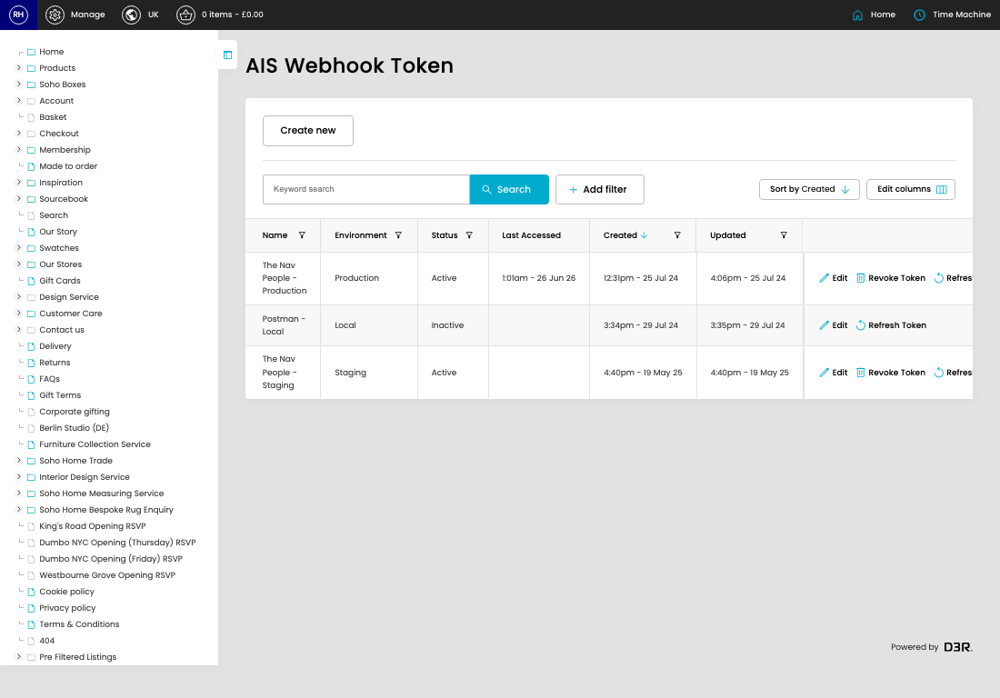

# Soho Home CP Feature Documentation

AIS Webhook Token is a bearer token used to authorise incoming AIS webhook requests before the site accepts the data they send.

*Soho Home CP Feature Documentation overview*

## What This Feature Does

- Incoming webhook calls must send the token as a bearer token. The request is rejected unless the token is active and belongs to the current environment.
- Each token can be limited to selected webhook services, so access can be granted for only the AIS feeds that need it.
- Refreshing a token generates a replacement value. Any external system using the old value must be updated afterwards.
- Revoking a token marks it inactive, which stops future webhook requests from authenticating with it.
- Last Accessed is updated after a successful request, which helps confirm whether a webhook integration is still using the token.
- Search or filter the visible fields to find the AIS webhook token you need.

## Screens Covered

1. [AIS Webhook Token](pages/001-cp-ais-webhooks-tokens-admin-a0f873de/README.md) - Search or filter the visible fields to find the AIS webhook token you need.
   URL: [https://sohohome.com/cp/ais-webhooks-tokens-admin](https://sohohome.com/cp/ais-webhooks-tokens-admin)
