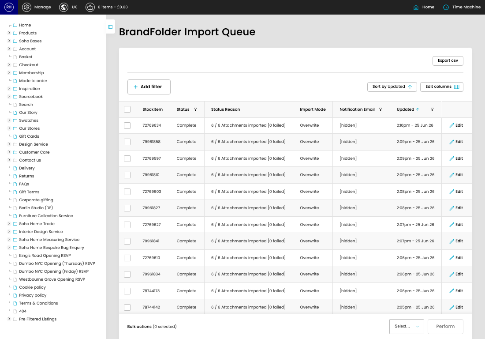

# Brandfolder Queue Admin

[Home](../../index.md) / Brandfolder Queue Admin

URL: [https://sohohome.com/cp/brandfolder-queue-admin](https://sohohome.com/cp/brandfolder-queue-admin)

Brandfolder Queue Admin lets admins find and review existing brandfolder queue admin.

*Brandfolder Queue Admin page overview*

## Using This Page

1. Scan the fields in the table to find the brandfolder queue admin you need.

## What You Can Do

### Review brandfolder queue admin

Review the visible fields to check what already exists.

- Visible fields include StockItem, Status, Status Reason, Import Mode, Notification Email, and Updated.

Example rows:

| StockItem | Status | Status Reason | Import Mode | Notification Email | Updated |
| --- | --- | --- | --- | --- | --- |
|  | 72769634 | Complete | 6 / 6 Attachments imported [0 failed] | [hidden] | [hidden] |
|  | 79961858 | Complete | 6 / 6 Attachments imported [0 failed] | [hidden] | [hidden] |
|  | 72769597 | Complete | 6 / 6 Attachments imported [0 failed] | [hidden] | [hidden] |
