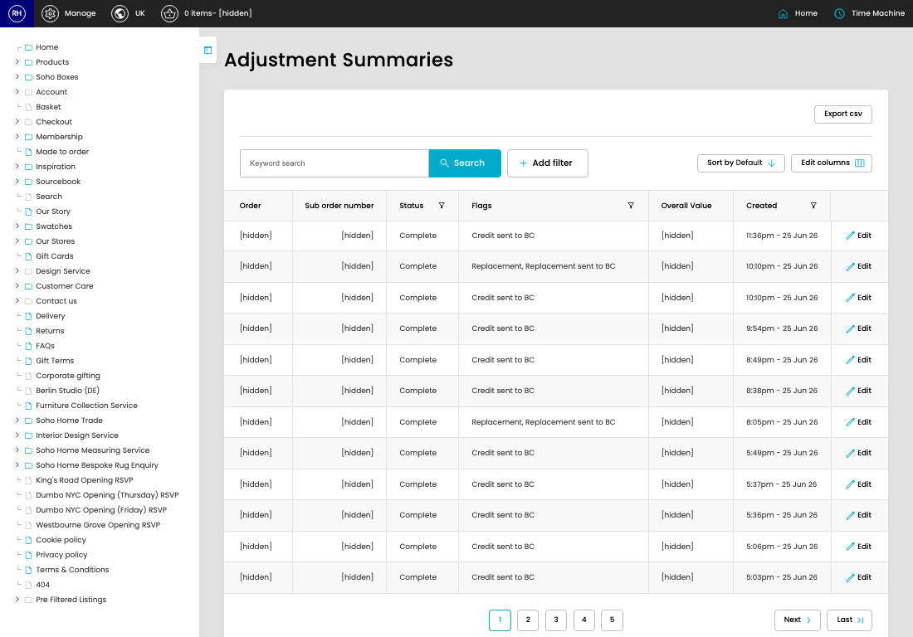

# Adjustment Summaries

[Home](../../index.md) / Adjustment Summaries

URL: [https://sohohome.com/cp/adjustments-summary-admin](https://sohohome.com/cp/adjustments-summary-admin)

Adjustment Summaries summarise order adjustments and related finance-system transfer activity for review.

*Adjustment Summaries page overview*

## How It Works

- Makes sure the transfer property is set appropriately.
- The key fields are Order, Sub order number, Status, Flags, and Overall Value, which explain what the record is for and how it can be used.

## Using This Page

1. Search or filter until you find the adjustment summary you need.

## What You Can Do

### Review adjustment summaries

Search or filter the visible fields to find the adjustment summary you need.

- Visible fields include Order, Sub order number, Status, Flags, Overall Value, and Created.
