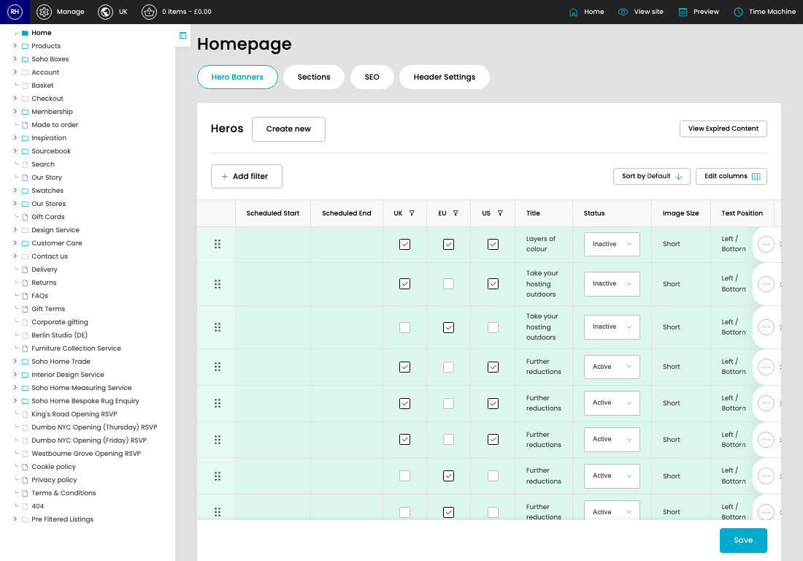

# Soho Home CP Feature Documentation

Soho Home CP Feature Documentation is where admins review existing soho home CP feature documentation and maintain the details behind each soho home CP feature documentation. The screens below show the usual path: find the right soho home CP feature documentation, create one if it does not exist, or open an existing one to update its fields.

*Soho Home CP Feature Documentation overview*

## What This Feature Does

- Review the visible fields to check what already exists.
- Use the fields on this screen to make the change, then save once the values are correct.

## Key Settings

- **Hero UK:** Set the Hero UK value for each relevant row in this section.
- **Hero EU:** Set the Hero EU value for each relevant row in this section.
- **Hero US:** Set the Hero US value for each relevant row in this section.
- **Hero Status:** Set the Hero Status value for each relevant row in this section.

## Screens Covered

1. [cp](pages/001-cp-55815406/README.md) - Review the visible fields to check what already exists.
   URL: [https://sohohome.com/cp](https://sohohome.com/cp)
