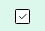
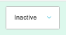

# cp

[Home](../../index.md) / cp

URL: [https://sohohome.com/cp](https://sohohome.com/cp)

cp lets admins find and review existing cp.

*cp page overview*

## Using This Page

1. Open cp from the CP navigation.
2. Scan the fields in the table to find the cp you need.

## What You Can Do

### Review cp

Review the visible fields to check what already exists.

- Field: Scheduled Start
- Field: Scheduled End
- Field: UK
- Field: EU
- Field: US
- Field: Title
- Field: Status
- Field: Image Size
- Field: Text Position
- Field: CTA 1
- Field: Included Personas
- Field: Excluded Type

### Update settings

Use the fields on this screen to make the change, then save once the values are correct.

## Key Settings

The sections below highlight the settings people are most likely to change.

### listing-home_heros-hero-form

#### Hero UK

*Hero UK setting*

Set the Hero UK value for each relevant row in this section.

#### Hero EU

*Hero EU setting*

Set the Hero EU value for each relevant row in this section.

#### Hero US

*Hero US setting*

Set the Hero US value for each relevant row in this section.

#### Hero Status

*Hero Status setting*

Set the Hero Status value for each relevant row in this section.

**Options:** Active, Inactive

## Available Actions

- Hero Banners
- Sections
- SEO
- Header Settings
- View Expired Content
