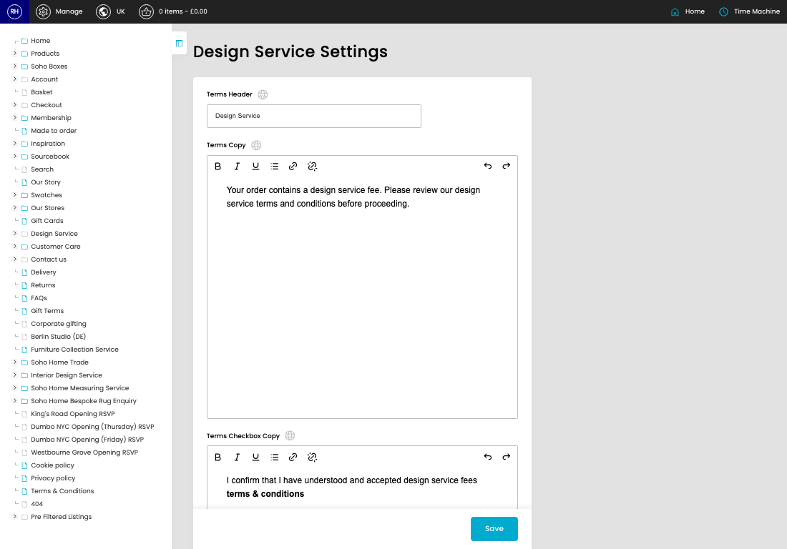

# Soho Home CP Feature Documentation

Design Service Settings controls the admin-managed settings and content used by the Design Service journey.

*Soho Home CP Feature Documentation overview*

## What This Feature Does

- Makes sure the transfer property is set appropriately.
- The key fields are Terms Header, Terms Copy, and Terms Checkbox Copy, which explain what the record is for and how it can be used.
- Use the fields on this screen to make the change, then save once the values are correct.

## Key Settings

- **Terms Header:** Add the terms header.
- **Terms Copy:** Write the terms copy content.
- **Terms Checkbox Copy:** Write the terms checkbox copy content.

## Screens Covered

1. [Design Service Settings](pages/001-cp-design-service-settings-admin-a125ea54/README.md) - Use the fields on this screen to make the change, then save once the values are correct.
   URL: [https://sohohome.com/cp/design-service-settings-admin](https://sohohome.com/cp/design-service-settings-admin)
