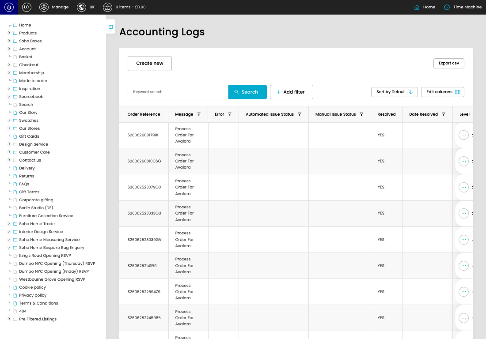

# Accounting Logs (Sage & Avalara)

[Home](../../index.md) / Accounting Logs (Sage & Avalara)

URL: [https://sohohome.com/cp/accounting-logs](https://sohohome.com/cp/accounting-logs)

Accounting Logs (Sage & Avalara) record Sage and Avalara accounting activity so integration issues and resolution status can be reviewed.

*Accounting Logs (Sage & Avalara) page overview*

## Related Pages

- [Edit Accounting Logs (Sage & Avalara)](../004-cp-accounting-logs-edit-881987-e9d3b5ea/README.md): Open an existing accounting logs (sage & avalara) when you need to check the setup or make a change.

## How It Works

- The key fields are Order Reference, Log, Order, Entity, and Message, which explain what the record is for and how it can be used.

## Using This Page

1. Open Accounting Logs (Sage & Avalara) from the CP navigation.
2. Search or filter until you find the accounting logs (sage & avalara) you need.
3. Open a row to check the details or make a change.

## What You Can Do

### Review accounting logs (sage & avalara)

Start here to find the accounting logs (sage & avalara) you need. Search or filter the visible fields, then open a row when you need the full details.

- Field: Order Reference
- Field: Message
- Field: Error
- Field: Automated Issue Status
- Field: Manual Issue Status
- Field: Resolved
- Field: Date Resolved
- Field: Level
- Field: Created

Example rows:

| Order Reference | Message | Error | Automated Issue Status | Manual Issue Status | Resolved |
| --- | --- | --- | --- | --- | --- |
| S26062600179IX | Process Order For Avalara |  |  |  | YES |
| S2606260010CSG | Process Order For Avalara |  |  |  | YES |
| S26062523379O0 | Process Order For Avalara |  |  |  | YES |

### Edit an existing accounting logs (sage & avalara)

Open an existing accounting logs (sage & avalara) when you need to check the setup or make a change.
