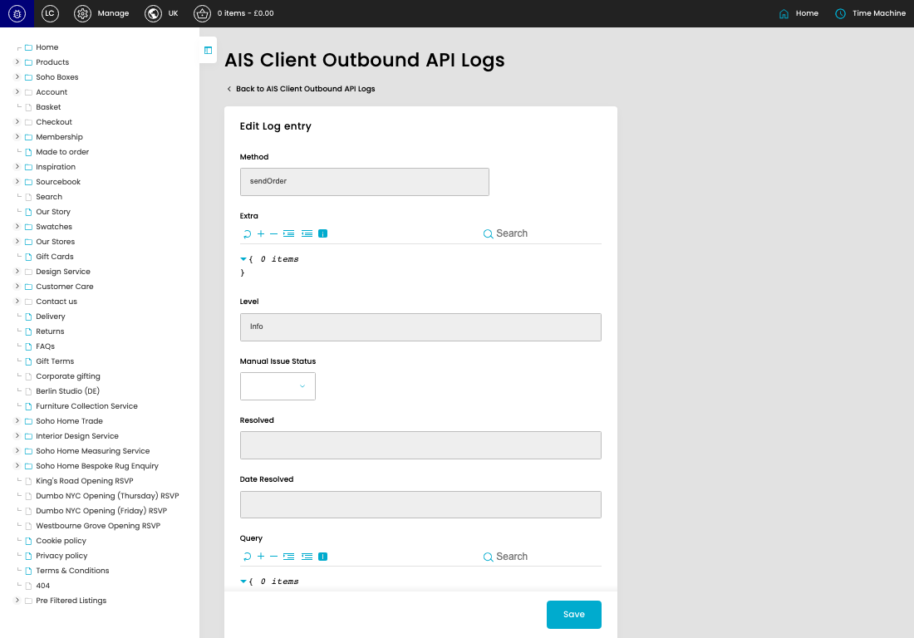
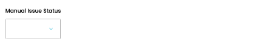

# Outbound API Logs

[Home](../../index.md) / Edit Outbound API Log

URL: [https://sohohome.com/cp/ais-client-outbound-logs/edit/715174](https://sohohome.com/cp/ais-client-outbound-logs/edit/715174)

Outbound API Logs record outbound AIS API requests so sent data, failures, and debug activity can be reviewed.

*Outbound API Logs page overview*

## Related Pages

- [Outbound API Logs](../007-cp-ais-client-outbound-logs-458c975b/README.md): Start here to find the outbound API log you need. Search or filter the visible fields, then open a row when you need the full details.

## Using This Page

1. Open the existing outbound API log you need to change.
2. Work through the fields that are relevant to the change.
3. Save once the details are correct.

## What You Can Do

### Edit an existing outbound API log

Open an existing outbound API log when you need to check the setup or make a change.

- Save once the details are correct.

## Key Settings

### Edit Log entry

#### Manual Issue Status

*Manual Issue Status setting*

Choose the option that matches this manual issue status.

**Options:** Resolved, Unresolved, nonissue
