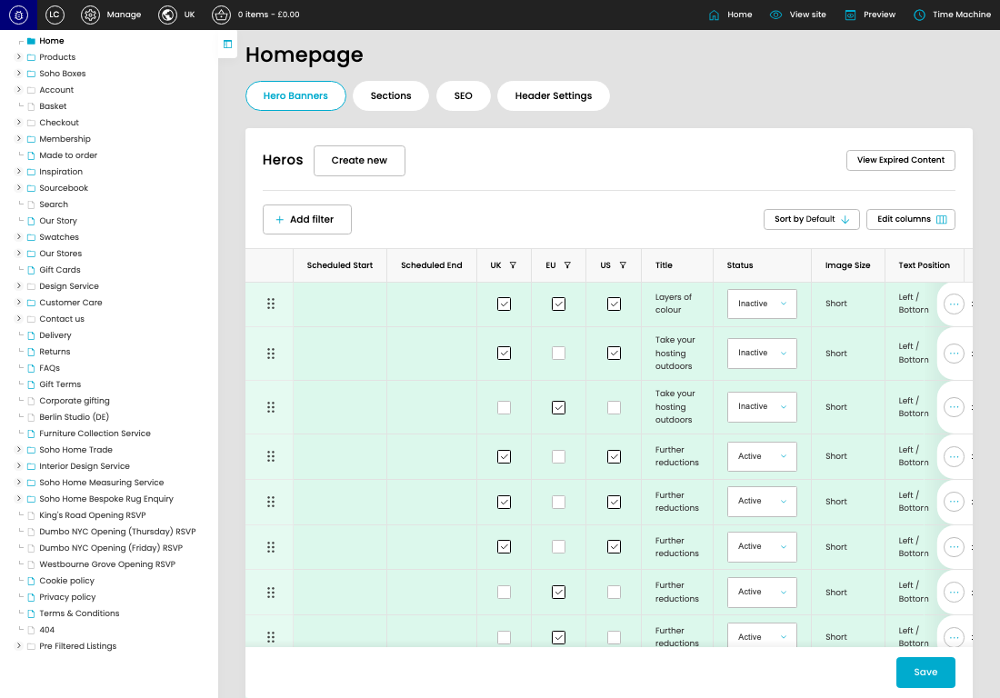
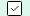
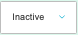

# Favourites

[Favourites overview](../../index.md) / Favourites listing

URL: [https://sohohome.com/cp](https://sohohome.com/cp)

This page covers Favourites.

*Favourites page overview*

## Using This Page

1. Open the Favourites page from the relevant navigation area or direct URL.
2. Use the listing to review existing Favourite entries.
3. Use the available create or edit actions to manage individual entries.

## What You Can Do

### Review existing entries

Use the listing to search, filter, and review existing Favourite entries.

- Column: Scheduled Start
- Column: Scheduled End
- Column: UK
- Column: EU
- Column: US
- Column: Title
- Column: Status
- Column: Image Size
- Column: Text Position
- Column: CTA 1
- Column: Included Personas
- Column: Excluded Type

### Create a new entry

Select Create new to add a Favourite entry, then complete the labelled settings and save.

### Edit an existing entry

Open an existing Favourite entry to review or update its settings.

- Save applies the changes.

## Key Settings

The sections below highlight the settings people are most likely to change.

### listing-home_heros-hero-form

#### Hero UK

*Hero UK setting*

Set the Hero UK value for each relevant row in this section.

**Effect:** Updates Hero UK.

#### Hero EU

*Hero EU setting*

Set the Hero EU value for each relevant row in this section.

**Effect:** Updates Hero EU.

#### Hero US

*Hero US setting*

Set the Hero US value for each relevant row in this section.

**Effect:** Updates Hero US.

#### Hero Status

*Hero Status setting*

Set the Hero Status value for each relevant row in this section.

**Effect:** Updates Hero Status.

**Options:** Active, Inactive

## Available Actions

- Hero Banners
- Sections
- SEO
- Header Settings
- Create new
- View Expired Content
- Add filter
- Sort by Default
- Edit columns
- Save
