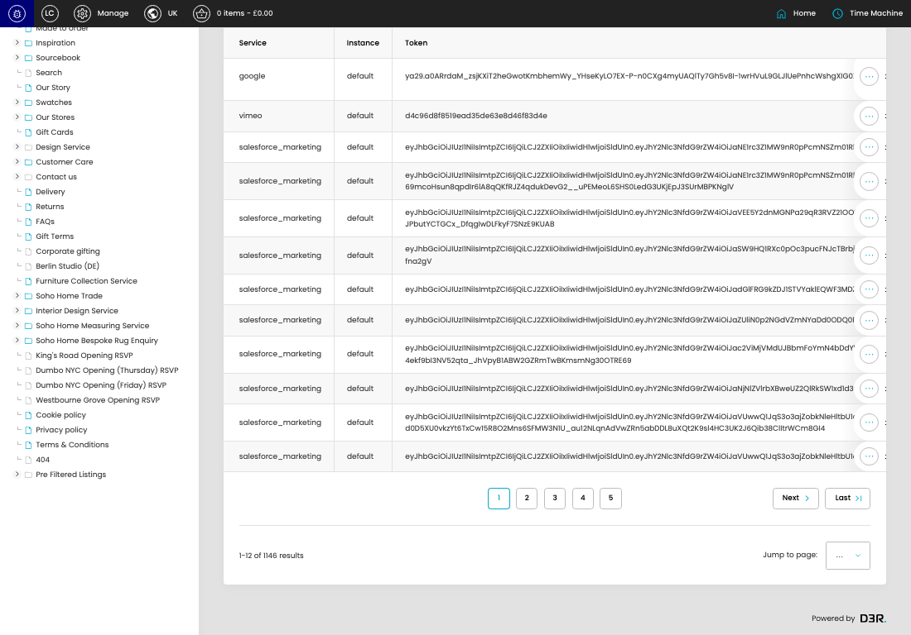
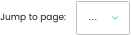

# Access Tokens

[Access Tokens overview](../../index.md) / Access Tokens listing

URL: [https://sohohome.com/cp/access-tokens](https://sohohome.com/cp/access-tokens)

This page covers Access Tokens.

*Access Tokens page overview*

## Using This Page

1. Open the Access Tokens page from the relevant navigation area or direct URL.
2. Use the listing to review existing Access Token entries.
3. Use the available create or edit actions to manage individual entries.

## What You Can Do

### Review existing entries

Use the listing to search, filter, and review existing Access Token entries.

- Column: Service
- Column: Instance
- Column: Token
- Column: Refresh Token
- Column: Expires

### Create a new entry

Select Create new to add a Access Token entry, then complete the labelled settings and save.

### Edit an existing entry

Open an existing Access Token entry to review or update its settings.

## Key Settings

The sections below highlight the settings people are most likely to change.

### Access Tokens

#### select

*select setting*

Choose the select from the available options.

**Effect:** Updates select.

**Options:** …, 1, 2, 3, 4, 5, 6, 7, 8, 9, 10, 11, and 18 more

## Available Actions

- Create new
- Sort by Default
- Edit columns
- 2
- 3
- 4
- 5
- Next
- Last
