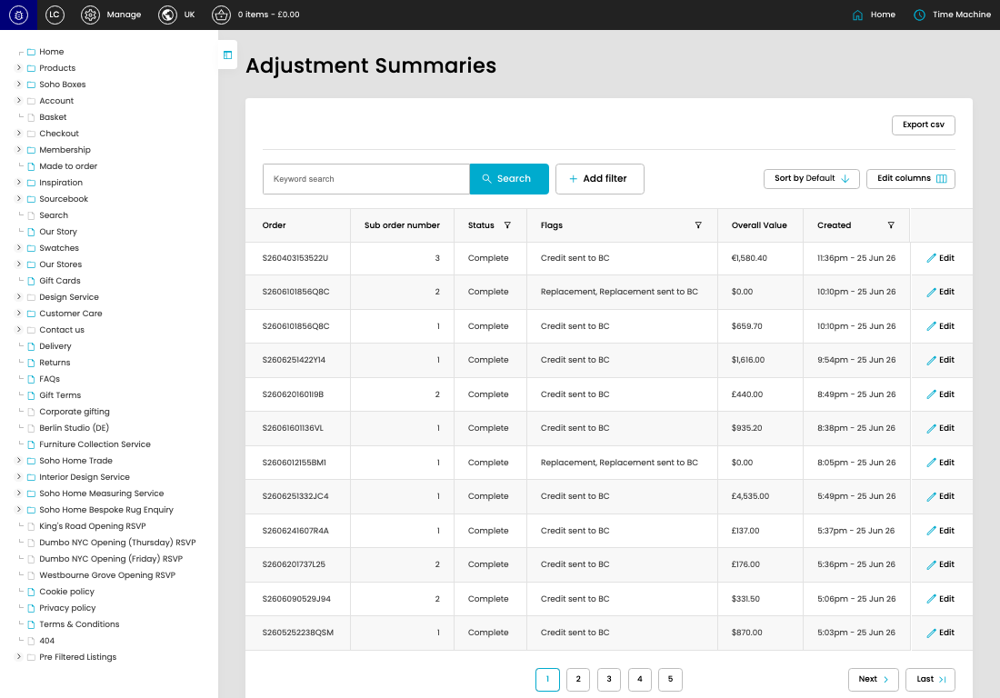

# Adjustment Summaries

[Adjustment Summaries overview](../../index.md) / Adjustment Summaries listing

URL: [https://sohohome.com/cp/adjustments-summary-admin](https://sohohome.com/cp/adjustments-summary-admin)

Use this page to manage Adjustment Summaries.

*Adjustment Summaries page overview*

## Using This Page

1. Open the Adjustment Summaries page from the relevant navigation area or direct URL.
2. Use the listing to review existing Adjustment Summary entries.
3. Use the available create or edit actions to manage individual entries.

## What You Can Do

### Review existing entries

Use the listing to search, filter, and review existing Adjustment Summary entries.

- Column: Order
- Column: Sub order number
- Column: Status
- Column: Flags
- Column: Overall Value
- Column: Created

### Create a new entry

Select Create new to add a Adjustment Summary entry, then complete the labelled settings and save.

### Edit an existing entry

Open an existing Adjustment Summary entry to review or update its settings.

## Available Actions

- Export csv
- Search
- Add filter
- Sort by Default
- Edit columns
- 2
- 3
- 4
- 5
- Next
- Last
