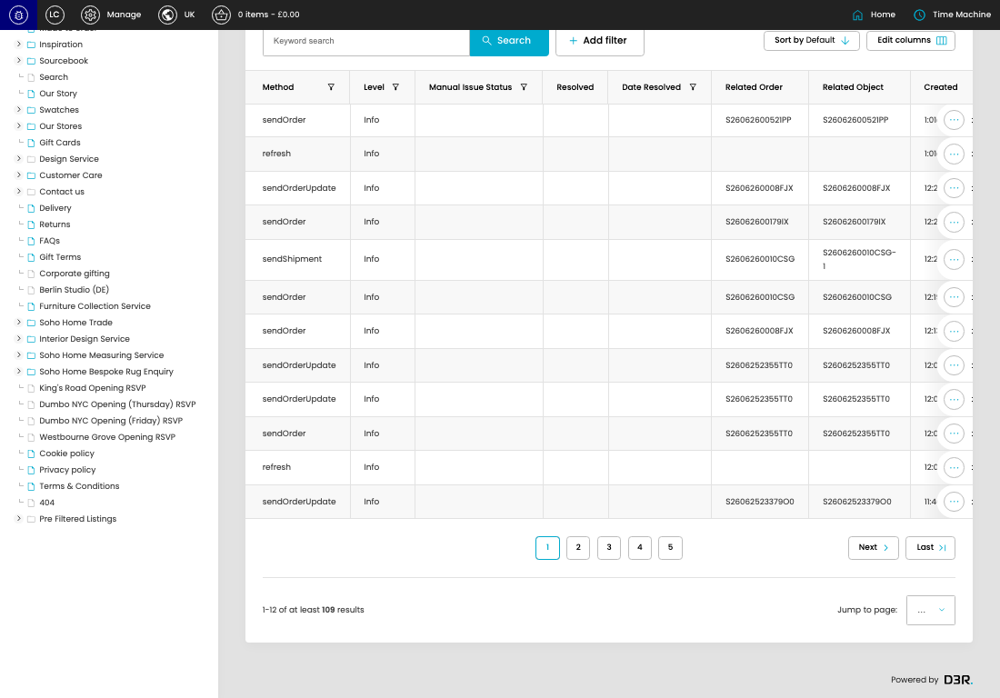
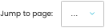

# Outbound API Logs

[Outbound API Logs overview](../../index.md) / Outbound API Logs listing

URL: [https://sohohome.com/cp/ais-client-outbound-logs](https://sohohome.com/cp/ais-client-outbound-logs)

This page covers Outbound API Logs.

*Outbound API Logs page overview*

## Using This Page

1. Open the Outbound API Logs page from the relevant navigation area or direct URL.
2. Use the listing to review existing Outbound API Log entries.
3. Use the available create or edit actions to manage individual entries.

## What You Can Do

### Review existing entries

Use the listing to search, filter, and review existing Outbound API Log entries.

- Column: Method
- Column: Level
- Column: Manual Issue Status
- Column: Resolved
- Column: Date Resolved
- Column: Related Order
- Column: Related Object
- Column: Created

### Create a new entry

Select Create new to add a Outbound API Log entry, then complete the labelled settings and save.

### Edit an existing entry

Open an existing Outbound API Log entry to review or update its settings.

## Key Settings

The sections below highlight the settings people are most likely to change.

### Outbound API Logs

#### select

*select setting*

Choose the select from the available options.

**Effect:** Updates select.

**Options:** …, 1, 2, 3, 4, 5, 6, 7, 8, 9, 10

## Available Actions

- Export csv
- Search
- Add filter
- Sort by Default
- Edit columns
- 2
- 3
- 4
- 5
- Next
- Last
