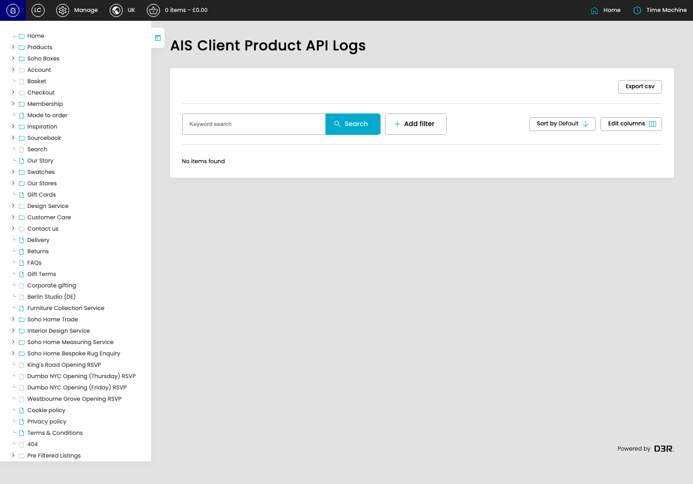

# Product API Logs

[Product API Logs overview](../../index.md) / Product API Logs

URL: [https://sohohome.com/cp/ais-client-product-logs](https://sohohome.com/cp/ais-client-product-logs)

This page covers Product API Logs.

*Product API Logs page overview*

## Using This Page

1. Open a Product API Log entry from the listing, or select Create new.
2. Complete the labelled settings for the entry.
3. Select Save to apply the changes.

## What You Can Do

### Create a new entry

Select Create new to add a Product API Log entry, then complete the labelled settings and save.

### Edit an existing entry

Open an existing Product API Log entry to review or update its settings.

## Available Actions

- Export csv
- Search
- Add filter
- Sort by Default
- Edit columns
