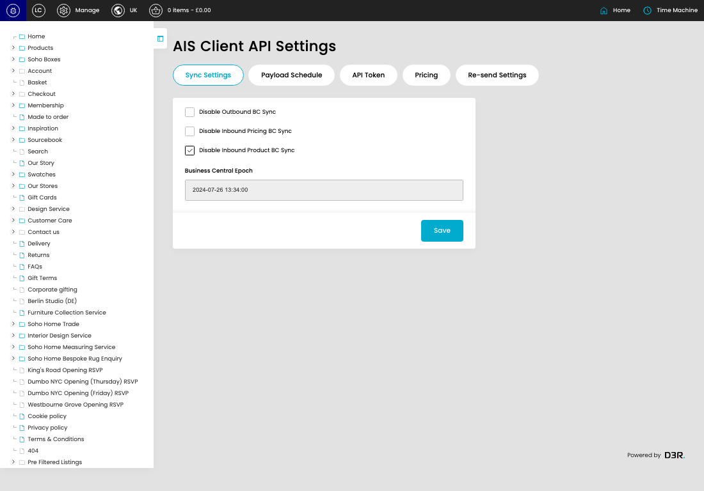

# Client API Settings

[Client API Settings overview](../../index.md) / Client API Settings

URL: [https://sohohome.com/cp/ais-client-settings](https://sohohome.com/cp/ais-client-settings)

This page covers Client API Settings.

*Client API Settings page overview*

## Using This Page

1. Open a Client API Setting entry from the listing, or select Create new.
2. Complete the labelled settings for the entry.
3. Select Save to apply the changes.

## What You Can Do

### Create a new entry

Select Create new to add a Client API Setting entry, then complete the labelled settings and save.

### Edit an existing entry

Open an existing Client API Setting entry to review or update its settings.

- Save applies the changes.

## Key Settings

The sections below highlight the settings people are most likely to change.

### Client API Settings

#### Disable Outbound BC Sync

*Disable Outbound BC Sync setting*

Enable or disable Disable Outbound BC Sync.

**Effect:** Updates Disable Outbound BC Sync.

#### Disable Inbound Pricing BC Sync

*Disable Inbound Pricing BC Sync setting*

Enable or disable Disable Inbound Pricing BC Sync.

**Effect:** Updates Disable Inbound Pricing BC Sync.

#### Disable Inbound Product BC Sync

*Disable Inbound Product BC Sync setting*

Enable or disable Disable Inbound Product BC Sync.

**Effect:** Updates Disable Inbound Product BC Sync.

## Available Actions

- Sync Settings
- Payload Schedule
- API Token
- Pricing
- Re-send Settings
- Save
