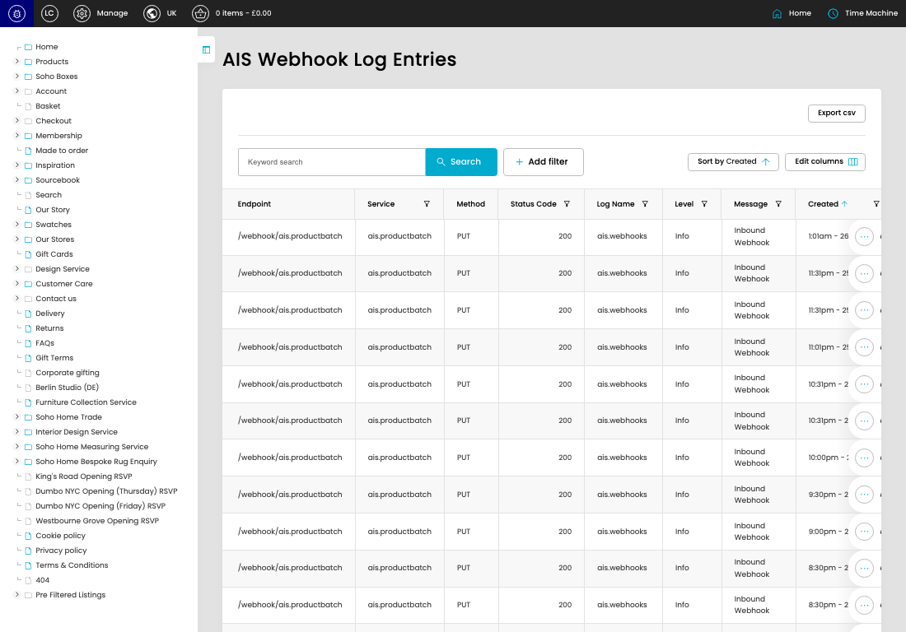

# Webhook Logs

[Webhook Logs overview](../../index.md) / Webhook Logs listing

URL: [https://sohohome.com/cp/ais-webhooks-logs-admin](https://sohohome.com/cp/ais-webhooks-logs-admin)

This page covers Webhook Logs.

*Webhook Logs page overview*

## Using This Page

1. Open the Webhook Logs page from the relevant navigation area or direct URL.
2. Use the listing to review existing Webhook Log entries.
3. Use the available create or edit actions to manage individual entries.

## What You Can Do

### Review existing entries

Use the listing to search, filter, and review existing Webhook Log entries.

- Column: Endpoint
- Column: Service
- Column: Method
- Column: Status Code
- Column: Log Name
- Column: Level
- Column: Message
- Column: Created
- Column: Updated

### Create a new entry

Select Create new to add a Webhook Log entry, then complete the labelled settings and save.

### Edit an existing entry

Open an existing Webhook Log entry to review or update its settings.

## Available Actions

- Export csv
- Search
- Add filter
- Sort by Created
- Edit columns
- 2
- 3
- 4
- 5
- Next
- Last
