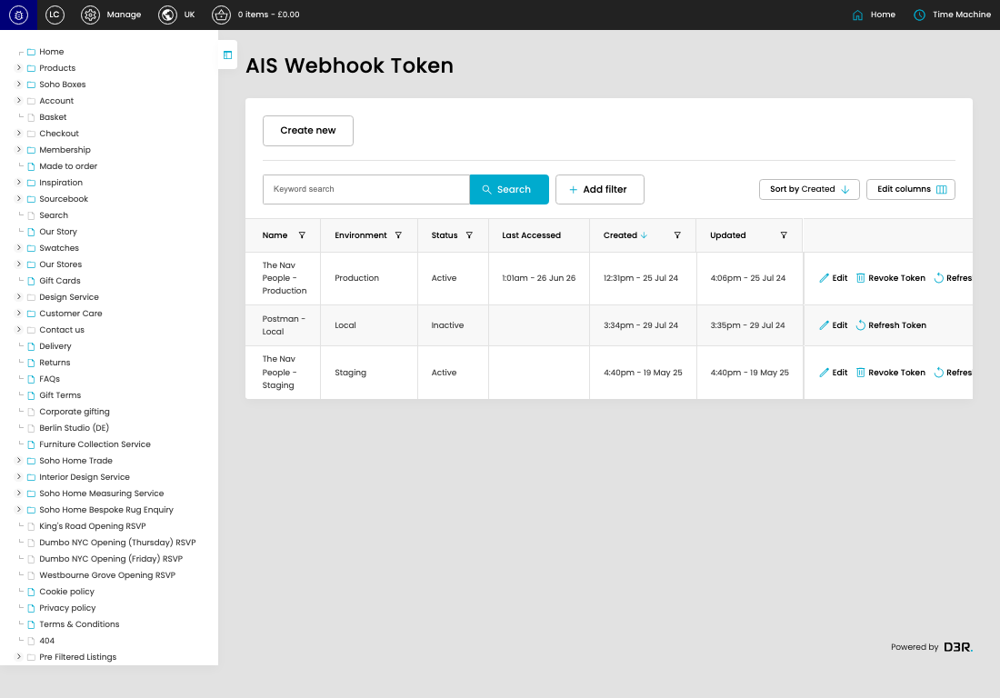

# Webhook Tokens

[Webhook Tokens overview](../../index.md) / Webhook Tokens listing

URL: [https://sohohome.com/cp/ais-webhooks-tokens-admin](https://sohohome.com/cp/ais-webhooks-tokens-admin)

This page covers Webhook Tokens.

*Webhook Tokens page overview*

## Using This Page

1. Open the Webhook Tokens page from the relevant navigation area or direct URL.
2. Use the listing to review existing Webhook Token entries.
3. Use the available create or edit actions to manage individual entries.

## What You Can Do

### Review existing entries

Use the listing to search, filter, and review existing Webhook Token entries.

- Column: Name
- Column: Environment
- Column: Status
- Column: Last Accessed
- Column: Created
- Column: Updated

### Create a new entry

Select Create new to add a Webhook Token entry, then complete the labelled settings and save.

### Edit an existing entry

Open an existing Webhook Token entry to review or update its settings.

## Available Actions

- Create new
- Search
- Add filter
- Sort by Created
- Edit columns
