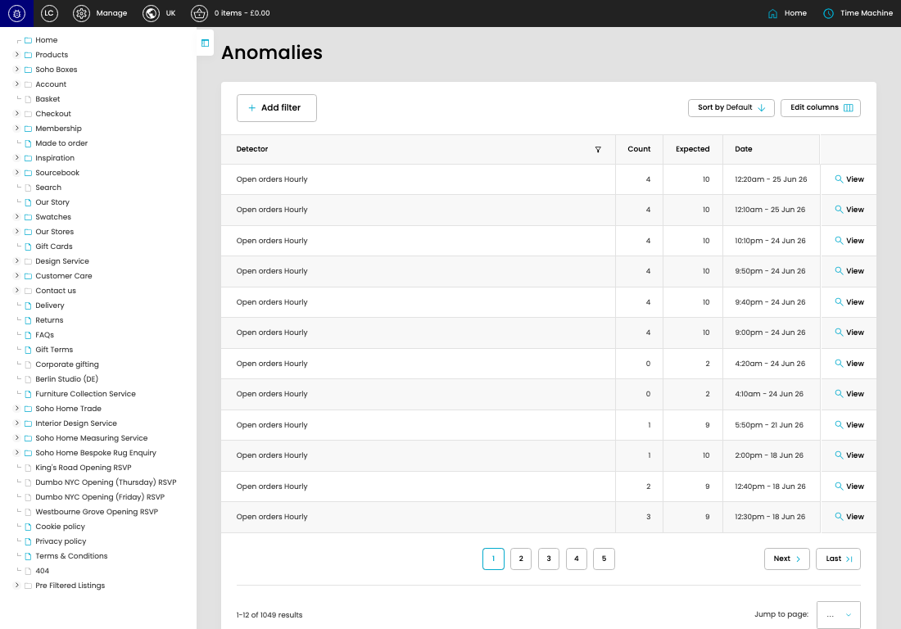
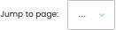

# Anomalies

[Anomalies overview](../../index.md) / Anomalies listing

URL: [https://sohohome.com/cp/anomaly-anomalies](https://sohohome.com/cp/anomaly-anomalies)

This page covers Anomalies.

*Anomalies page overview*

## Using This Page

1. Open the Anomalies page from the relevant navigation area or direct URL.
2. Use the listing to review existing Anomaly entries.
3. Use the available create or edit actions to manage individual entries.

## What You Can Do

### Review existing entries

Use the listing to search, filter, and review existing Anomaly entries.

- Column: Detector
- Column: Count
- Column: Expected
- Column: Date

### Create a new entry

Select Create new to add a Anomaly entry, then complete the labelled settings and save.

### Edit an existing entry

Open an existing Anomaly entry to review or update its settings.

## Key Settings

The sections below highlight the settings people are most likely to change.

### Anomalies

#### select

*select setting*

Choose the select from the available options.

**Effect:** Updates select.

**Options:** …, 1, 2, 3, 4, 5, 6, 7, 8, 9, 10, 11, and 18 more

## Available Actions

- Add filter
- Sort by Default
- Edit columns
- 2
- 3
- 4
- 5
- Next
- Last
