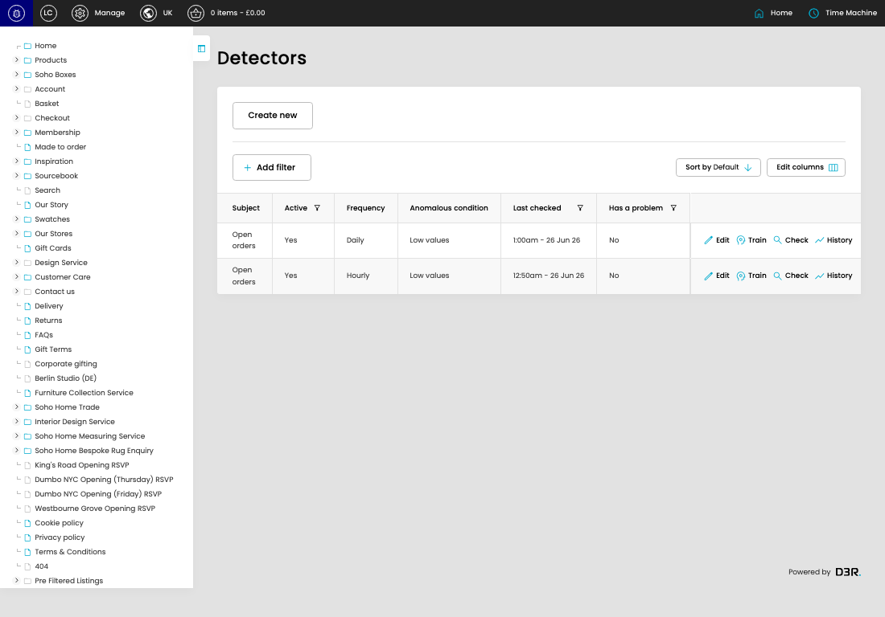

# Anomaly Detectors

[Anomaly Detectors overview](../../index.md) / Anomaly Detectors listing

URL: [https://sohohome.com/cp/anomaly-detectors](https://sohohome.com/cp/anomaly-detectors)

This page covers Anomaly Detectors.

*Anomaly Detectors page overview*

## Using This Page

1. Open the Anomaly Detectors page from the relevant navigation area or direct URL.
2. Use the listing to review existing Anomaly Detector entries.
3. Use the available create or edit actions to manage individual entries.

## What You Can Do

### Review existing entries

Use the listing to search, filter, and review existing Anomaly Detector entries.

- Column: Subject
- Column: Active
- Column: Frequency
- Column: Anomalous condition
- Column: Last checked
- Column: Has a problem
- Column: Problem began
- Column: Problem resolved

### Create a new entry

Select Create new to add a Anomaly Detector entry, then complete the labelled settings and save.

### Edit an existing entry

Open an existing Anomaly Detector entry to review or update its settings.

## Available Actions

- Create new
- Add filter
- Sort by Default
- Edit columns
