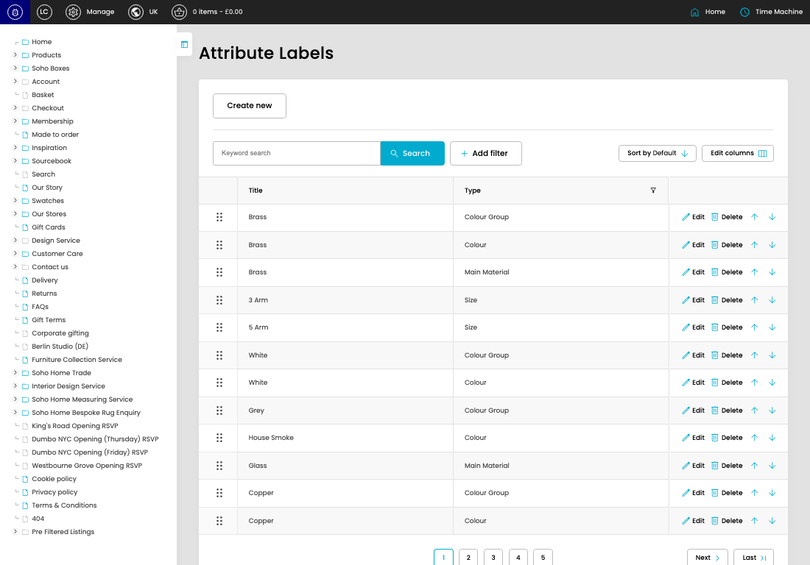

# Attribute Labels

[Attribute Labels overview](../../index.md) / Attribute Labels listing

URL: [https://sohohome.com/cp/attribute-labels-admin](https://sohohome.com/cp/attribute-labels-admin)

Use this page to manage Attribute Labels.

*Attribute Labels page overview*

## Using This Page

1. Open the Attribute Labels page from the relevant navigation area or direct URL.
2. Use the listing to review existing Attribute Label entries.
3. Use the available create or edit actions to manage individual entries.

## What You Can Do

### Review existing entries

Use the listing to search, filter, and review existing Attribute Label entries.

- Column: Title
- Column: Type

### Create a new entry

Select Create new to add a Attribute Label entry, then complete the labelled settings and save.

### Edit an existing entry

Open an existing Attribute Label entry to review or update its settings.

## Available Actions

- Create new
- Search
- Add filter
- Sort by Default
- Edit columns
- 2
- 3
- 4
- 5
- Next
- Last
