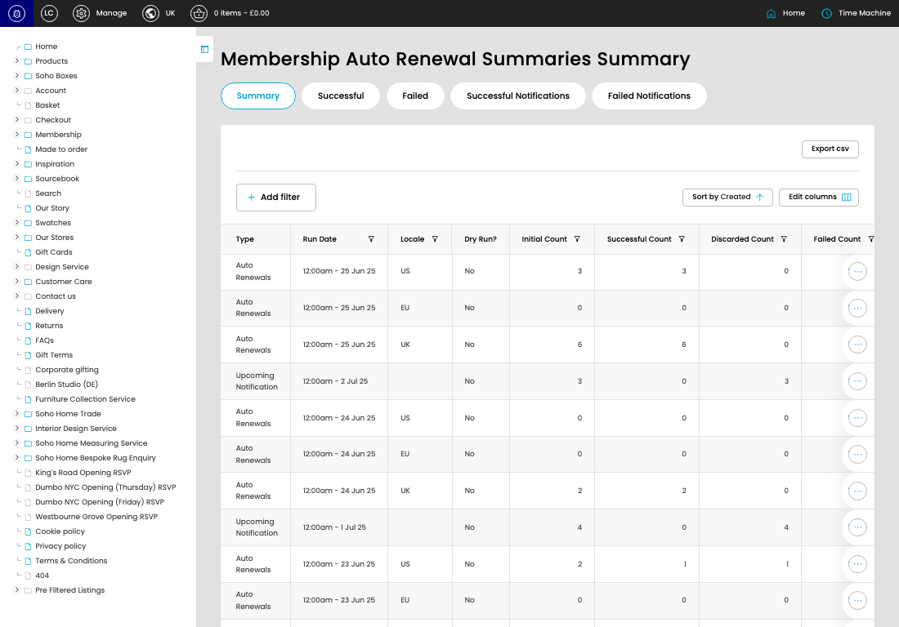

# Auto Renewal Summaries

[Auto Renewal Summaries overview](../../index.md) / Auto Renewal Summaries listing

URL: [https://sohohome.com/cp/auto-renewal-summary-admin](https://sohohome.com/cp/auto-renewal-summary-admin)

This page covers Auto Renewal Summaries.

*Auto Renewal Summaries page overview*

## Using This Page

1. Open the Auto Renewal Summaries page from the relevant navigation area or direct URL.
2. Use the listing to review existing Auto Renewal Summary entries.
3. Use the available create or edit actions to manage individual entries.

## What You Can Do

### Review existing entries

Use the listing to search, filter, and review existing Auto Renewal Summary entries.

- Column: Type
- Column: Run Date
- Column: Locale
- Column: Dry Run?
- Column: Initial Count
- Column: Successful Count
- Column: Discarded Count
- Column: Failed Count
- Column: Created

### Create a new entry

Select Create new to add a Auto Renewal Summary entry, then complete the labelled settings and save.

### Edit an existing entry

Open an existing Auto Renewal Summary entry to review or update its settings.

## Available Actions

- Summary
- Successful
- Failed
- Successful Notifications
- Failed Notifications
- Export csv
- Add filter
- Sort by Created
- Edit columns
- 2
- 3
- 4
- 5
- Next
- Last
