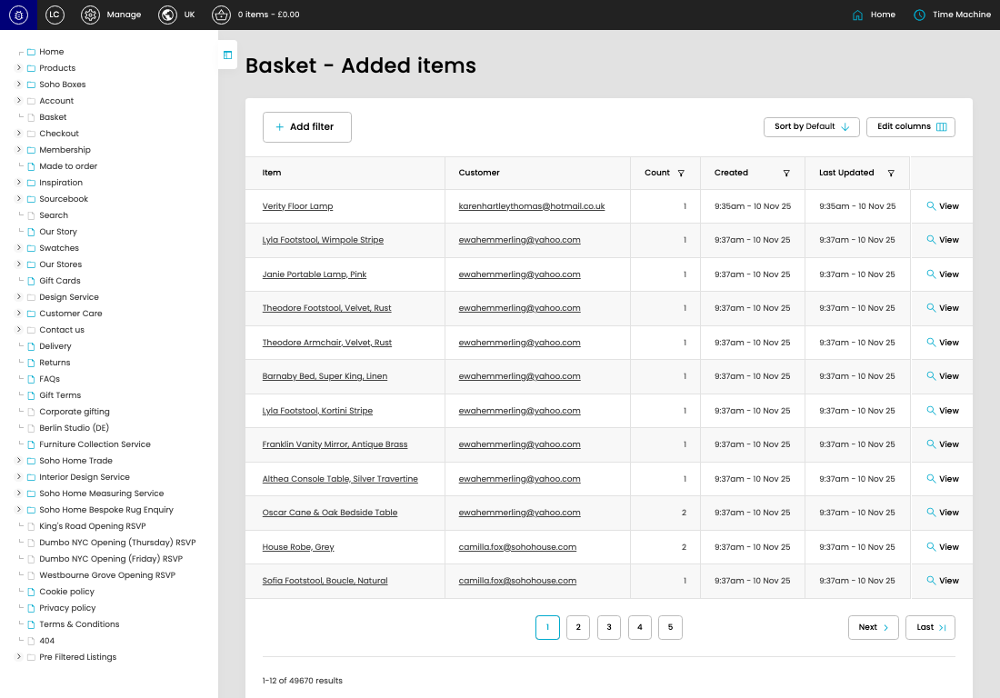

# Basket - Added Items

[Basket - Added Items overview](../../index.md) / Basket - Added Items listing

URL: [https://sohohome.com/cp/basket-added-items-admin](https://sohohome.com/cp/basket-added-items-admin)

This page covers Basket - Added Items.

*Basket - Added Items page overview*

## Using This Page

1. Open the Basket - Added Items page from the relevant navigation area or direct URL.
2. Use the listing to review existing Basket - Added Item entries.
3. Use the available create or edit actions to manage individual entries.

## What You Can Do

### Review existing entries

Use the listing to search, filter, and review existing Basket - Added Item entries.

- Column: Item
- Column: Customer
- Column: Count
- Column: Created
- Column: Last Updated

### Create a new entry

Select Create new to add a Basket - Added Item entry, then complete the labelled settings and save.

### Edit an existing entry

Open an existing Basket - Added Item entry to review or update its settings.

## Available Actions

- Add filter
- Sort by Default
- Edit columns
- 2
- 3
- 4
- 5
- Next
- Last
