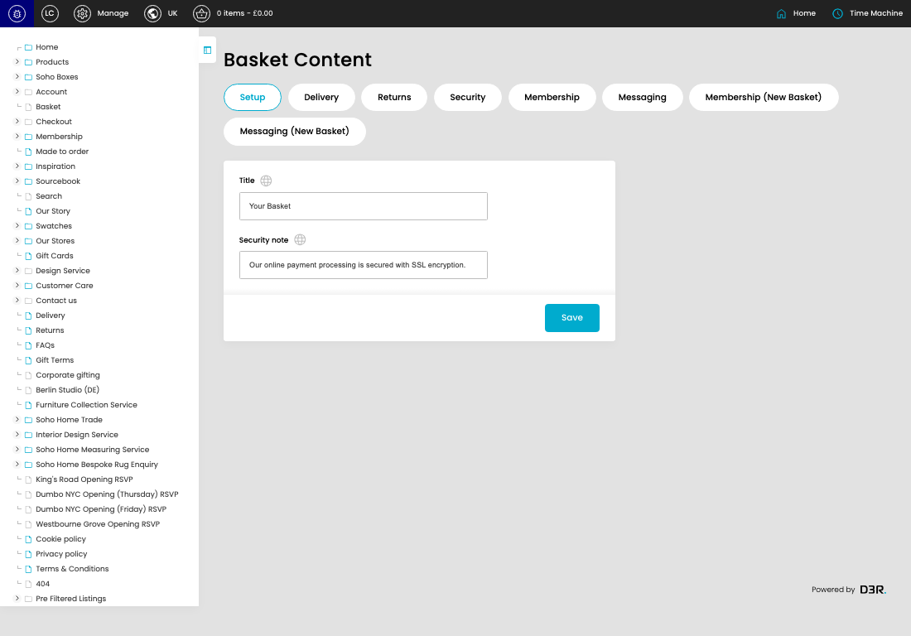

# Basket Content

[Basket Content overview](../../index.md) / Basket Content

URL: [https://sohohome.com/cp/basket-admin](https://sohohome.com/cp/basket-admin)

Use this page to manage Basket Content.

*Basket Content page overview*

## Using This Page

1. Open a Basket Content entry from the listing, or select Create new.
2. Complete the labelled settings for the entry.
3. Select Save to apply the changes.

## What You Can Do

### Create a new entry

Select Create new to add a Basket Content entry, then complete the labelled settings and save.

### Edit an existing entry

Open an existing Basket Content entry to review or update its settings.

- Save applies the changes.

## Key Settings

The sections below highlight the settings people are most likely to change.

### Basket Content

#### Title

*Title setting*

Enter the Title.

**Effect:** Updates Title.

**Validation:** Required.

#### Security note

*Security note setting*

Enter the Security note.

**Effect:** Updates Security note.

**Validation:** Required.

## Available Actions

- Setup
- Delivery
- Returns
- Security
- Membership
- Messaging
- Membership (New Basket)
- Messaging (New Basket)
- Save
