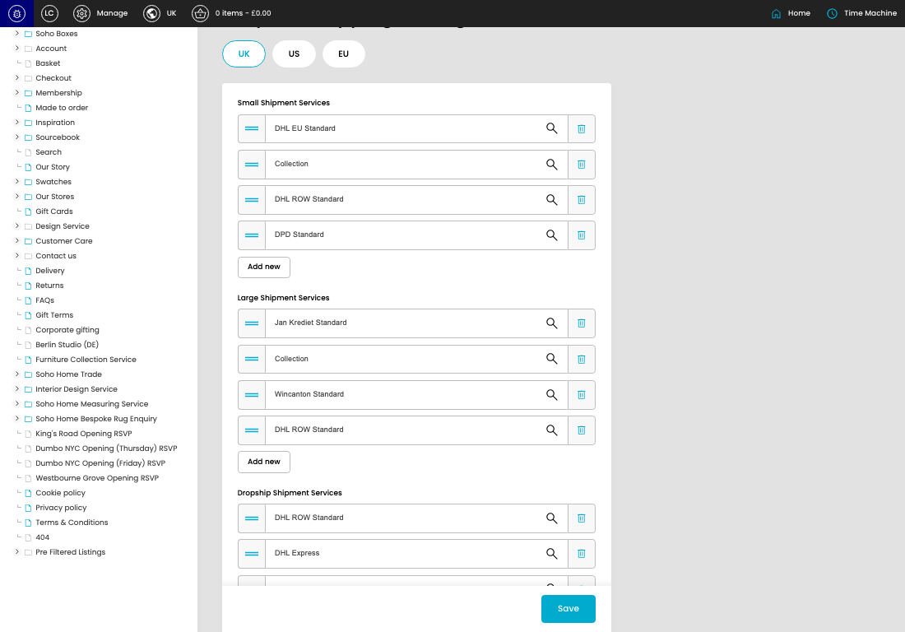

# Bespoke Shipping Settings

[Bespoke Shipping Settings overview](../../index.md) / Bespoke Shipping Settings

URL: [https://sohohome.com/cp/bespoke-settings-admin](https://sohohome.com/cp/bespoke-settings-admin)

Use this page to manage Bespoke Shipping Settings.

*Bespoke Shipping Settings page overview*

## Using This Page

1. Open a Bespoke Shipping Setting entry from the listing, or select Create new.
2. Complete the labelled settings for the entry.
3. Select Save to apply the changes.

## What You Can Do

### Create a new entry

Select Create new to add a Bespoke Shipping Setting entry, then complete the labelled settings and save.

### Edit an existing entry

Open an existing Bespoke Shipping Setting entry to review or update its settings.

- Save applies the changes.

## Available Actions

- UK
- US
- EU
- Add new
- Save
