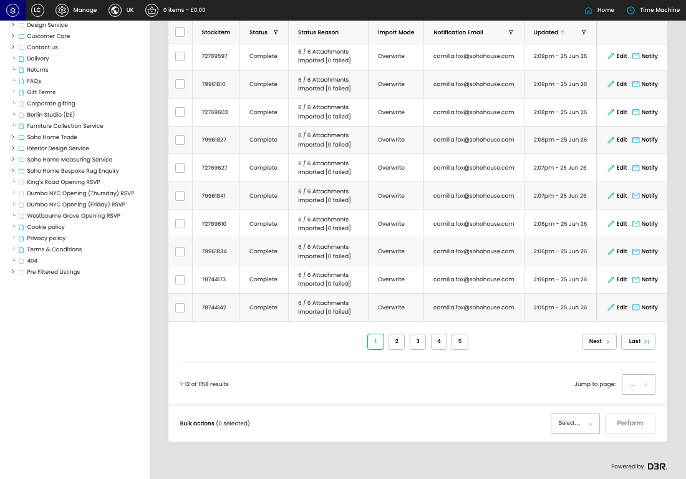

# BrandFolder Import Queue

[BrandFolder Import Queue overview](../../index.md) / BrandFolder Import Queue listing

URL: [https://sohohome.com/cp/brandfolder-queue-admin](https://sohohome.com/cp/brandfolder-queue-admin)

This page covers BrandFolder Import Queue.

*BrandFolder Import Queue page overview*

## Using This Page

1. Open the BrandFolder Import Queue page from the relevant navigation area or direct URL.
2. Use the listing to review existing BrandFolder Import Queue entries.
3. Use the available create or edit actions to manage individual entries.

## What You Can Do

### Review existing entries

Use the listing to search, filter, and review existing BrandFolder Import Queue entries.

- Column: StockItem
- Column: Status
- Column: Status Reason
- Column: Import Mode
- Column: Notification Email
- Column: Updated

### Create a new entry

Select Create new to add a BrandFolder Import Queue entry, then complete the labelled settings and save.

### Edit an existing entry

Open an existing BrandFolder Import Queue entry to review or update its settings.

## Key Settings

The sections below highlight the settings people are most likely to change.

### Bulk actions (0 selected)

#### input

*input setting*

Enable or disable input.

**Effect:** Updates input.

#### input

Enable or disable input.

**Effect:** Updates input.

#### model_listing[33406]

*model_listing[33406] setting*

Enable or disable model_listing[33406].

**Effect:** Updates model_listing[33406].

#### model_listing[33405]

*model_listing[33405] setting*

Enable or disable model_listing[33405].

**Effect:** Updates model_listing[33405].

#### model_listing[33404]

*model_listing[33404] setting*

Enable or disable model_listing[33404].

**Effect:** Updates model_listing[33404].

#### model_listing[33403]

*model_listing[33403] setting*

Enable or disable model_listing[33403].

**Effect:** Updates model_listing[33403].

#### model_listing[33402]

*model_listing[33402] setting*

Enable or disable model_listing[33402].

**Effect:** Updates model_listing[33402].

#### model_listing[33401]

*model_listing[33401] setting*

Enable or disable model_listing[33401].

**Effect:** Updates model_listing[33401].

#### model_listing[33400]

Enable or disable model_listing[33400].

**Effect:** Updates model_listing[33400].

#### model_listing[33399]

Enable or disable model_listing[33399].

**Effect:** Updates model_listing[33399].

#### model_listing[33398]

Enable or disable model_listing[33398].

**Effect:** Updates model_listing[33398].

#### model_listing[33397]

Enable or disable model_listing[33397].

**Effect:** Updates model_listing[33397].

#### model_listing[33396]

Enable or disable model_listing[33396].

**Effect:** Updates model_listing[33396].

#### model_listing[33395]

Enable or disable model_listing[33395].

**Effect:** Updates model_listing[33395].

#### select

Choose the select from the available options.

**Effect:** Updates select.

**Options:** …, 1, 2, 3, 4, 5, 6, 7, 8, 9, 10, 11, and 18 more

#### select

Choose the select from the available options.

**Effect:** Updates select.

**Options:** Cancel, Retry

## Available Actions

- Export csv
- Add filter
- Sort by Updated
- Edit columns
- 2
- 3
- 4
- 5
- Next
- Last
- Perform
