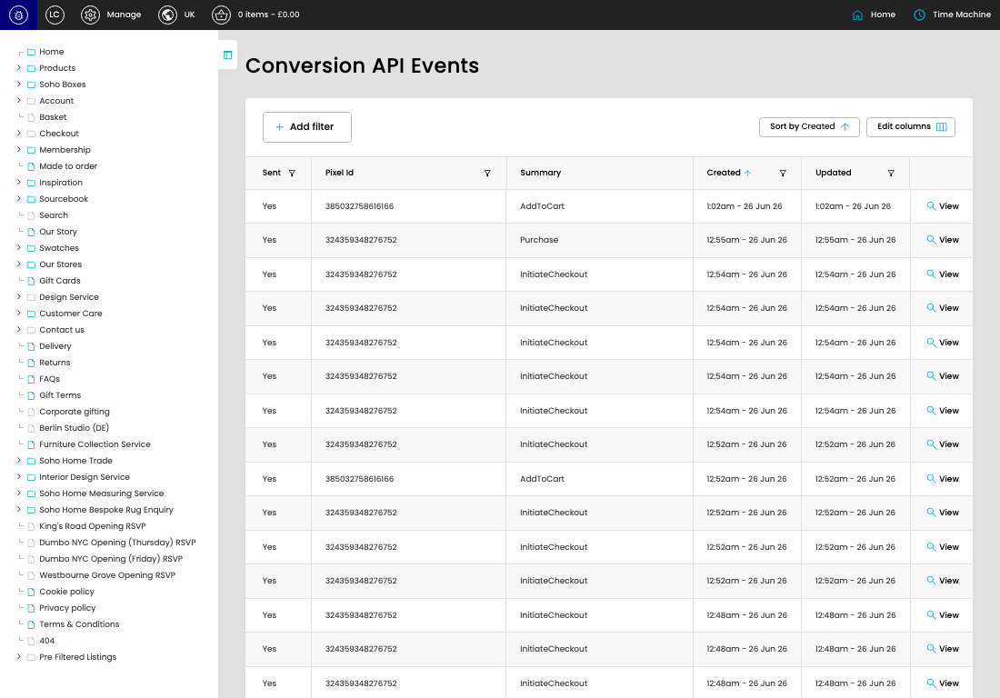

# Conversion API

[Conversion API overview](../../index.md) / Conversion API listing

URL: [https://sohohome.com/cp/capi](https://sohohome.com/cp/capi)

This page covers Conversion API.

*Conversion API page overview*

## Using This Page

1. Open the Conversion API page from the relevant navigation area or direct URL.
2. Use the listing to review existing Conversion API entries.
3. Use the available create or edit actions to manage individual entries.

## What You Can Do

### Review existing entries

Use the listing to search, filter, and review existing Conversion API entries.

- Column: Sent
- Column: Pixel Id
- Column: Summary
- Column: Created
- Column: Updated

### Create a new entry

Select Create new to add a Conversion API entry, then complete the labelled settings and save.

### Edit an existing entry

Open an existing Conversion API entry to review or update its settings.

## Available Actions

- Add filter
- Sort by Created
- Edit columns
- 2
- 3
- 4
- 5
- Next
- Last
