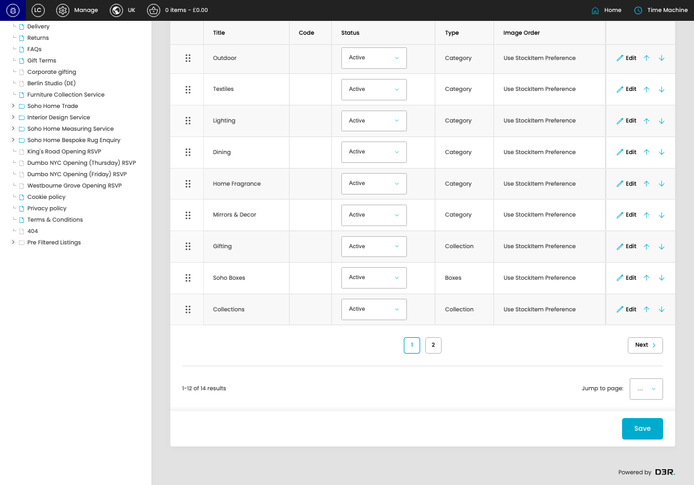
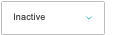
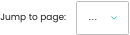

# Categories -

[Categories - overview](../../index.md) / Categories - listing

URL: [https://sohohome.com/cp/categories-admin](https://sohohome.com/cp/categories-admin)

Use this page to manage Categories - .

*Categories - page overview*

## Using This Page

1. Open the Categories - page from the relevant navigation area or direct URL.
2. Use the listing to review existing Categories - entries.
3. Use the available create or edit actions to manage individual entries.

## What You Can Do

### Review existing entries

Use the listing to search, filter, and review existing Categories - entries.

- Column: Title
- Column: Code
- Column: Status
- Column: Type
- Column: Image Order

### Create a new entry

Select Create new to add a Categories - entry, then complete the labelled settings and save.

### Edit an existing entry

Open an existing Categories - entry to review or update its settings.

- Save applies the changes.

## Key Settings

The sections below highlight the settings people are most likely to change.

### listing-product_category-form

#### Category Status

*Category Status setting*

Set the Category Status value for each relevant row in this section.

**Effect:** Updates Category Status.

**Options:** Active, Members Only, Hidden, Inactive, Archived

#### select

*select setting*

Choose the select from the available options.

**Effect:** Updates select.

**Options:** …, 1, 2

## Available Actions

- Online
- Archived
- Create new
- Import csv
- Sort by Default
- Edit columns
- 2
- Next
- Save
