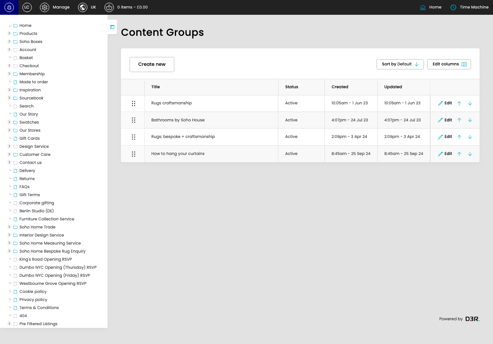

# Content Groups

[Content Groups overview](../../index.md) / Content Groups listing

URL: [https://sohohome.com/cp/categories-content-admin](https://sohohome.com/cp/categories-content-admin)

Use this page to manage Content Groups.

*Content Groups page overview*

## Using This Page

1. Open the Content Groups page from the relevant navigation area or direct URL.
2. Use the listing to review existing Content Group entries.
3. Use the available create or edit actions to manage individual entries.

## What You Can Do

### Review existing entries

Use the listing to search, filter, and review existing Content Group entries.

- Column: Title
- Column: Status
- Column: Created
- Column: Updated

### Create a new entry

Select Create new to add a Content Group entry, then complete the labelled settings and save.

### Edit an existing entry

Open an existing Content Group entry to review or update its settings.

## Available Actions

- Create new
- Sort by Default
- Edit columns
