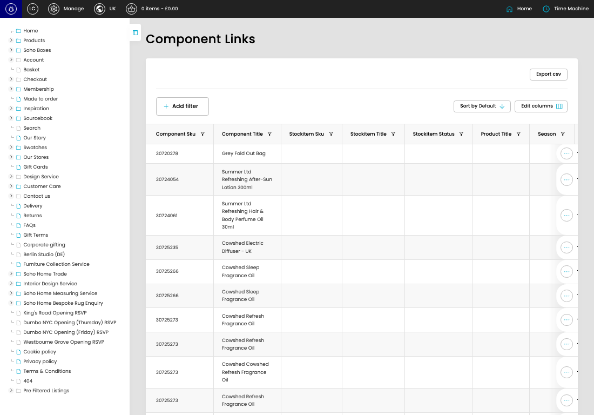

# Component Links

[Component Links overview](../../index.md) / Component Links listing

URL: [https://sohohome.com/cp/component-links-admin](https://sohohome.com/cp/component-links-admin)

Use this page to manage Component Links.

*Component Links page overview*

## Using This Page

1. Open the Component Links page from the relevant navigation area or direct URL.
2. Use the listing to review existing Component Link entries.
3. Use the available create or edit actions to manage individual entries.

## What You Can Do

### Review existing entries

Use the listing to search, filter, and review existing Component Link entries.

- Column: Component Sku
- Column: Component Title
- Column: Stockitem Sku
- Column: Stockitem Title
- Column: Stockitem Status
- Column: Product Title
- Column: Season
- Column: Outer Carton Weight
- Column: Outer Carton Width (cm)
- Column: Outer Carton Height (cm)
- Column: Outer Carton Depth (cm)
- Column: Link Quantity

### Create a new entry

Select Create new to add a Component Link entry, then complete the labelled settings and save.

### Edit an existing entry

Open an existing Component Link entry to review or update its settings.

## Available Actions

- Export csv
- Add filter
- Sort by Default
- Edit columns
- 2
- 3
- 4
- 5
- Next
- Last
