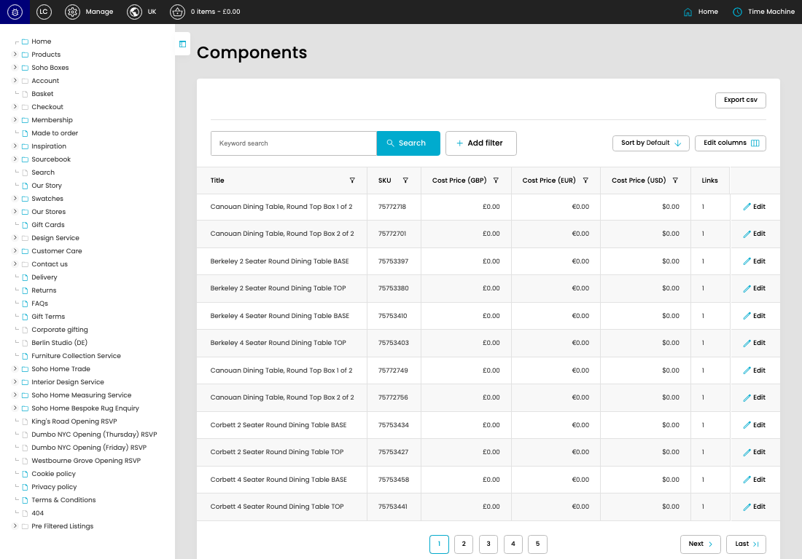

# Components

[Components overview](../../index.md) / Components listing

URL: [https://sohohome.com/cp/components-admin](https://sohohome.com/cp/components-admin)

Use this page to manage Components.

*Components page overview*

## Using This Page

1. Open the Components page from the relevant navigation area or direct URL.
2. Use the listing to review existing Component entries.
3. Use the available create or edit actions to manage individual entries.

## What You Can Do

### Review existing entries

Use the listing to search, filter, and review existing Component entries.

- Column: Title
- Column: SKU
- Column: Cost Price (GBP)
- Column: Cost Price (EUR)
- Column: Cost Price (USD)
- Column: Links

### Create a new entry

Select Create new to add a Component entry, then complete the labelled settings and save.

### Edit an existing entry

Open an existing Component entry to review or update its settings.

## Available Actions

- Export csv
- Search
- Add filter
- Sort by Default
- Edit columns
- 2
- 3
- 4
- 5
- Next
- Last
