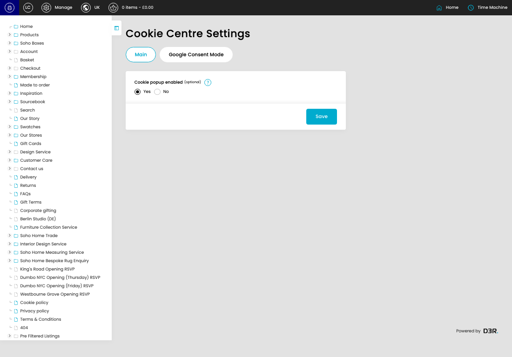

# Cookie settings

[Cookie settings overview](../../index.md) / Cookie settings

URL: [https://sohohome.com/cp/cookies-settings-admin](https://sohohome.com/cp/cookies-settings-admin)

This page covers Cookie settings.

*Cookie settings page overview*

## Using This Page

1. Open a Cookie Setting entry from the listing, or select Create new.
2. Complete the labelled settings for the entry.
3. Select Save to apply the changes.

## What You Can Do

### Create a new entry

Select Create new to add a Cookie Setting entry, then complete the labelled settings and save.

### Edit an existing entry

Open an existing Cookie Setting entry to review or update its settings.

- Save applies the changes.

## Key Settings

The sections below highlight the settings people are most likely to change.

### Cookie settings

#### Yes

*Yes setting*

Choose the Yes from the available options.

**Effect:** Updates Yes.

**Notes:** optional

#### No

*No setting*

Choose the No from the available options.

**Effect:** Updates No.

**Notes:** optional

## Available Actions

- Main
- Google Consent Mode
- Save
