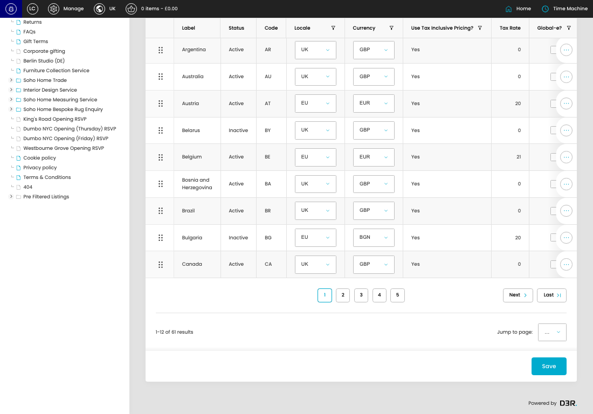
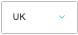
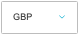
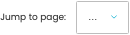

# Countries

[Countries overview](../../index.md) / Countries listing

URL: [https://sohohome.com/cp/countries-admin](https://sohohome.com/cp/countries-admin)

This page covers Countries.

*Countries page overview*

## Using This Page

1. Open the Countries page from the relevant navigation area or direct URL.
2. Use the listing to review existing Country entries.
3. Use the available create or edit actions to manage individual entries.

## What You Can Do

### Review existing entries

Use the listing to search, filter, and review existing Country entries.

- Column: Label
- Column: Status
- Column: Code
- Column: Locale
- Column: Currency
- Column: Use Tax Inclusive Pricing?
- Column: Tax Rate
- Column: Global-e?

### Create a new entry

Select Create new to add a Country entry, then complete the labelled settings and save.

### Edit an existing entry

Open an existing Country entry to review or update its settings.

- Save applies the changes.

## Key Settings

The sections below highlight the settings people are most likely to change.

### listing-locale_country-form

#### Country Locale

*Country Locale setting*

Set the Country Locale value for each relevant row in this section.

**Effect:** Updates Country Locale.

**Options:** UK, EU, US

#### Country Currency

*Country Currency setting*

Set the Country Currency value for each relevant row in this section.

**Effect:** Updates Country Currency.

**Options:** GBP, EUR, USD, BGN, CZK, DKK, HUF, PLN, RON, SEK

#### Country Global E

*Country Global E setting*

Set the Country Global E value for each relevant row in this section.

**Effect:** Updates Country Global E.

#### select

*select setting*

Choose the select from the available options.

**Effect:** Updates select.

**Options:** …, 1, 2, 3, 4, 5, 6

## Available Actions

- Create new
- Search
- Add filter
- Sort by Default
- Edit columns
- 2
- 3
- 4
- 5
- Next
- Last
- Save
