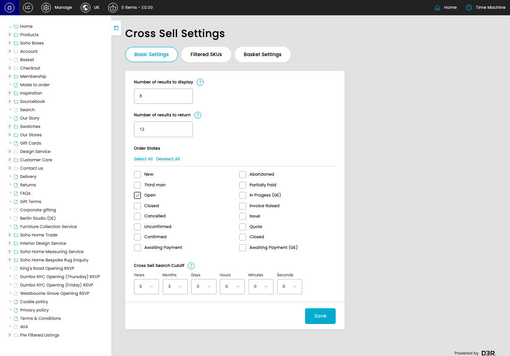
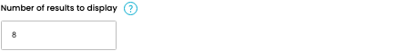
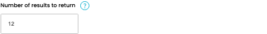

# Cross Sell

[Cross Sell overview](../../index.md) / Cross Sell

URL: [https://sohohome.com/cp/cross-sell-admin](https://sohohome.com/cp/cross-sell-admin)

This page covers Cross Sell.

*Cross Sell page overview*

## Using This Page

1. Open a Cross Sell entry from the listing, or select Create new.
2. Complete the labelled settings for the entry.
3. Select Save to apply the changes.

## What You Can Do

### Create a new entry

Select Create new to add a Cross Sell entry, then complete the labelled settings and save.

### Edit an existing entry

Open an existing Cross Sell entry to review or update its settings.

- Save applies the changes.

## Key Settings

The sections below highlight the settings people are most likely to change.

### Cross Sell

#### Number of results to display

*Number of results to display setting*

Enter the Number of results to display.

**Effect:** Updates Number of results to display.

**Validation:** Required.

#### Number of results to return

*Number of results to return setting*

Enter the Number of results to return.

**Effect:** Updates Number of results to return.

**Validation:** Required.

#### New

*New setting*

Enable or disable New.

**Effect:** Updates New.

#### Third man

*Third man setting*

Enable or disable Third man.

**Effect:** Updates Third man.

#### Open

*Open setting*

Enable or disable Open.

**Effect:** Updates Open.

#### Closed

*Closed setting*

Enable or disable Closed.

**Effect:** Updates Closed.

#### Cancelled

*Cancelled setting*

Enable or disable Cancelled.

**Effect:** Updates Cancelled.

#### Unconfirmed

*Unconfirmed setting*

Enable or disable Unconfirmed.

**Effect:** Updates Unconfirmed.

#### Confirmed

Enable or disable Confirmed.

**Effect:** Updates Confirmed.

#### Awaiting Payment

Enable or disable Awaiting Payment.

**Effect:** Updates Awaiting Payment.

#### Abandoned

Enable or disable Abandoned.

**Effect:** Updates Abandoned.

#### Partially Paid

Enable or disable Partially Paid.

**Effect:** Updates Partially Paid.

#### In Progess (GE)

Enable or disable In Progess (GE).

**Effect:** Updates In Progess (GE).

#### Invoice Raised

Enable or disable Invoice Raised.

**Effect:** Updates Invoice Raised.

#### Issue

Enable or disable Issue.

**Effect:** Updates Issue.

#### Quote

Enable or disable Quote.

**Effect:** Updates Quote.

#### Closed

Enable or disable Closed.

**Effect:** Updates Closed.

#### Awaiting Payment (GE)

Enable or disable Awaiting Payment (GE).

**Effect:** Updates Awaiting Payment (GE).

#### Years

Choose the Years from the available options.

**Effect:** Updates Years.

**Options:** …, 0, 1, 2, 3, 4, 5, 6, 7, 8, 9, 10

#### Months

Choose the Months from the available options.

**Effect:** Updates Months.

**Options:** …, 0, 1, 2, 3, 4, 5, 6, 7, 8, 9, 10, and 1 more

#### Days

Choose the Days from the available options.

**Effect:** Updates Days.

**Options:** …, 0, 1, 2, 3, 4, 5, 6, 7, 8, 9, 10, and 18 more

#### Hours

Choose the Hours from the available options.

**Effect:** Updates Hours.

**Options:** …, 0, 1, 2, 3, 4, 5, 6, 7, 8, 9, 10, and 13 more

#### Minutes

Choose the Minutes from the available options.

**Effect:** Updates Minutes.

**Options:** …, 0, 1, 2, 3, 4, 5, 6, 7, 8, 9, 10, and 18 more

#### Seconds

Choose the Seconds from the available options.

**Effect:** Updates Seconds.

**Options:** …, 0, 1, 2, 3, 4, 5, 6, 7, 8, 9, 10, and 18 more

## Available Actions

- Basic Settings
- Filtered SKUs
- Basket Settings
- Save
