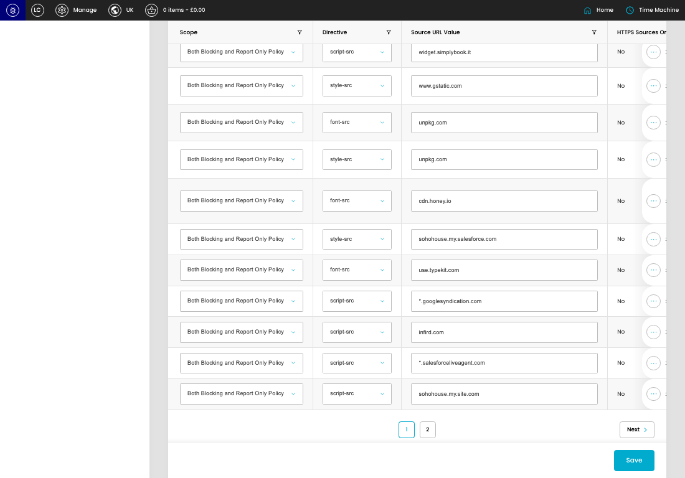
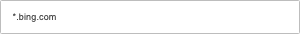

# Content Security Policy

[Content Security Policy overview](../../index.md) / Content Security Policy listing

URL: [https://sohohome.com/cp/csp-admin](https://sohohome.com/cp/csp-admin)

This page covers Content Security Policy.

*Content Security Policy page overview*

## Using This Page

1. Open the Content Security Policy page from the relevant navigation area or direct URL.
2. Use the listing to review existing Content Security Policy entries.
3. Use the available create or edit actions to manage individual entries.

## What You Can Do

### Review existing entries

Use the listing to search, filter, and review existing Content Security Policy entries.

- Column: Scope
- Column: Directive
- Column: Source URL Value
- Column: HTTPS Sources Only
- Column: Self Allowed
- Column: Data Allowed
- Column: Blob Allowed
- Column: Media Stream Allowed
- Column: Unsafe Eval Allowed
- Column: Unsafe Inline Allowed
- Column: Status
- Column: Note

### Create a new entry

Select Create new to add a Content Security Policy entry, then complete the labelled settings and save.

### Edit an existing entry

Open an existing Content Security Policy entry to review or update its settings.

- Save applies the changes.

## Key Settings

The sections below highlight the settings people are most likely to change.

### listing-d3r\websecurity\model\source-form

#### Source Scope

*Source Scope setting*

Set the Source Scope value for each relevant row in this section.

**Effect:** Updates Source Scope.

**Options:** None, Blocking Policy, Report Only Policy, Both Blocking and Report Only Policy

#### Source Directive

*Source Directive setting*

Set the Source Directive value for each relevant row in this section.

**Effect:** Updates Source Directive.

**Options:** child-src, connect-src, default-src, font-src, frame-ancestors, frame-src, img-src, manifest-src, media-src, object-src, prefetch-src, script-src, and 6 more

#### Source Value

*Source Value setting*

Set the Source Value value for each relevant row in this section.

**Effect:** Updates Source Value.

#### Source Status

*Source Status setting*

Set the Source Status value for each relevant row in this section.

**Effect:** Updates Source Status.

**Options:** Active, Inactive

#### select

Choose the select from the available options.

**Effect:** Updates select.

**Options:** …, 1, 2

## Available Actions

- Create new
- Search
- Add filter
- Sort by Default
- Edit columns
- 2
- Next
- Save
