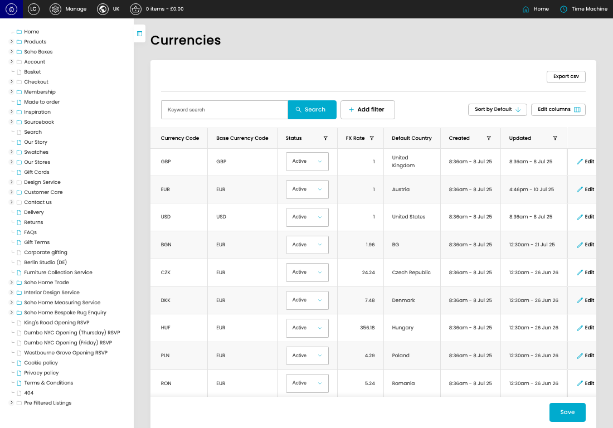
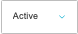

# Currencies

[Currencies overview](../../index.md) / Currencies listing

URL: [https://sohohome.com/cp/currencies-admin](https://sohohome.com/cp/currencies-admin)

Use this page to manage Currencies.

*Currencies page overview*

## Using This Page

1. Open the Currencies page from the relevant navigation area or direct URL.
2. Use the listing to review existing Currency entries.
3. Use the available create or edit actions to manage individual entries.

## What You Can Do

### Review existing entries

Use the listing to search, filter, and review existing Currency entries.

- Column: Currency Code
- Column: Base Currency Code
- Column: Status
- Column: FX Rate
- Column: Default Country
- Column: Created
- Column: Updated

### Create a new entry

Select Create new to add a Currency entry, then complete the labelled settings and save.

### Edit an existing entry

Open an existing Currency entry to review or update its settings.

- Save applies the changes.

## Key Settings

The sections below highlight the settings people are most likely to change.

### listing-store_currency-form

#### Currency Status

*Currency Status setting*

Set the Currency Status value for each relevant row in this section.

**Effect:** Updates Currency Status.

**Options:** Active, Inactive

## Available Actions

- Export csv
- Search
- Add filter
- Sort by Default
- Edit columns
- Save
