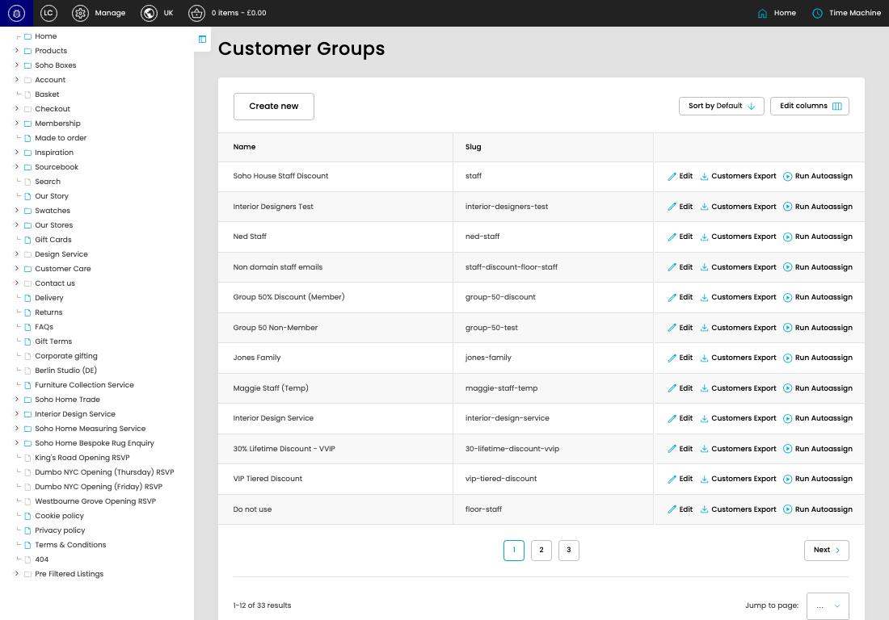
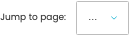

# Customer Groups

[Customer Groups overview](../../index.md) / Customer Groups listing

URL: [https://sohohome.com/cp/customer-groups-admin](https://sohohome.com/cp/customer-groups-admin)

Use this page to manage Customer Groups.

*Customer Groups page overview*

## Using This Page

1. Open the Customer Groups page from the relevant navigation area or direct URL.
2. Use the listing to review existing Customer Group entries.
3. Use the available create or edit actions to manage individual entries.

## What You Can Do

### Review existing entries

Use the listing to search, filter, and review existing Customer Group entries.

- Column: Name
- Column: Slug

### Create a new entry

Select Create new to add a Customer Group entry, then complete the labelled settings and save.

### Edit an existing entry

Open an existing Customer Group entry to review or update its settings.

## Key Settings

The sections below highlight the settings people are most likely to change.

### Customer Groups

#### select

*select setting*

Choose the select from the available options.

**Effect:** Updates select.

**Options:** …, 1, 2, 3

## Available Actions

- Create new
- Sort by Default
- Edit columns
- 2
- 3
- Next
