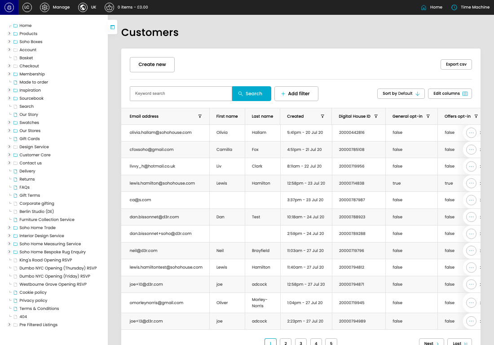

# Customers

[Customers overview](../../index.md) / Customers listing

URL: [https://sohohome.com/cp/customers](https://sohohome.com/cp/customers)

This page covers Customers.

*Customers page overview*

## Using This Page

1. Open the Customers page from the relevant navigation area or direct URL.
2. Use the listing to review existing Customer entries.
3. Use the available create or edit actions to manage individual entries.

## What You Can Do

### Review existing entries

Use the listing to search, filter, and review existing Customer entries.

- Column: Email address
- Column: First name
- Column: Last name
- Column: Created
- Column: Digital House ID
- Column: General opt-in
- Column: Offers opt-in
- Column: Affiliates opt-in
- Column: Membership Type
- Column: Membership Status
- Column: UK Trade Tier
- Column: US Trade Tier

### Create a new entry

Select Create new to add a Customer entry, then complete the labelled settings and save.

### Edit an existing entry

Open an existing Customer entry to review or update its settings.

## Available Actions

- Create new
- Export csv
- Search
- Add filter
- Sort by Default
- Edit columns
- 2
- 3
- 4
- 5
- Next
- Last
