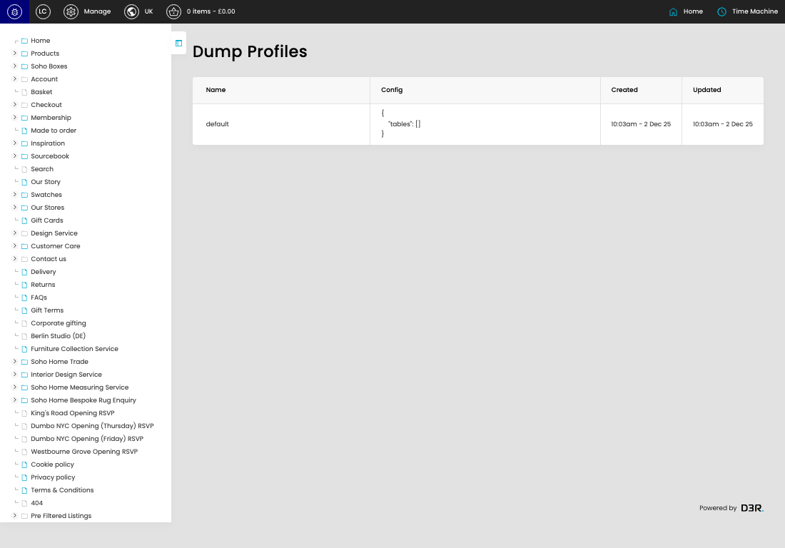

# Database Dump Profiles

[Database Dump Profiles overview](../../index.md) / Database Dump Profiles listing

URL: [https://sohohome.com/cp/database-dumper-admin](https://sohohome.com/cp/database-dumper-admin)

This page covers Database Dump Profiles.

*Database Dump Profiles page overview*

## Using This Page

1. Open the Database Dump Profiles page from the relevant navigation area or direct URL.
2. Use the listing to review existing Database Dump Profile entries.
3. Use the available create or edit actions to manage individual entries.

## What You Can Do

### Review existing entries

Use the listing to search, filter, and review existing Database Dump Profile entries.

- Column: Name
- Column: Config
- Column: Created
- Column: Updated

### Create a new entry

Select Create new to add a Database Dump Profile entry, then complete the labelled settings and save.

### Edit an existing entry

Open an existing Database Dump Profile entry to review or update its settings.
