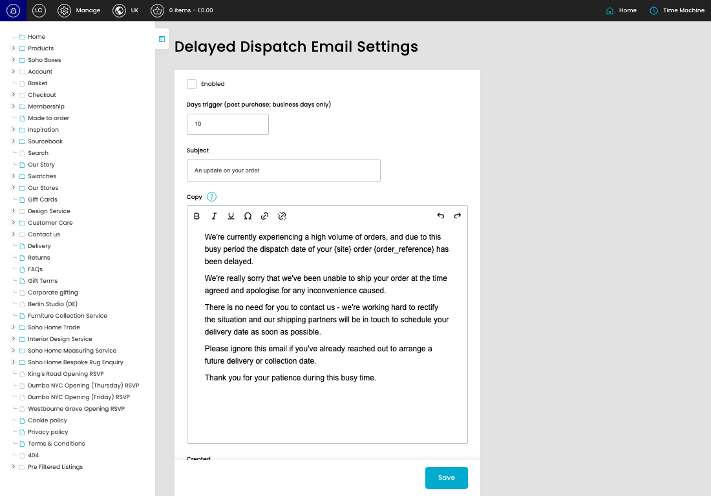
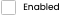
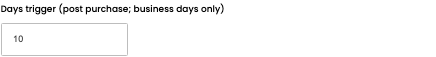
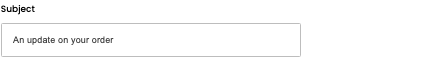

# Delayed Dispatch Email Settings

[Delayed Dispatch Email Settings overview](../../index.md) / Delayed Dispatch Email Settings

URL: [https://sohohome.com/cp/delayed-dispatch-email-settings-admin](https://sohohome.com/cp/delayed-dispatch-email-settings-admin)

Use this page to manage Delayed Dispatch Email Settings.

*Delayed Dispatch Email Settings page overview*

## Using This Page

1. Open a Delayed Dispatch Email Setting entry from the listing, or select Create new.
2. Complete the labelled settings for the entry.
3. Select Save to apply the changes.

## What You Can Do

### Create a new entry

Select Create new to add a Delayed Dispatch Email Setting entry, then complete the labelled settings and save.

### Edit an existing entry

Open an existing Delayed Dispatch Email Setting entry to review or update its settings.

- Save applies the changes.

## Key Settings

The sections below highlight the settings people are most likely to change.

### Delayed Dispatch Email Settings

#### Enabled

*Enabled setting*

Enable or disable Enabled.

**Effect:** Updates Enabled.

#### Days trigger (post purchase; business days only)

*Days trigger (post purchase; business days only) setting*

Enter the Days trigger (post purchase; business days only).

**Effect:** Updates Days trigger (post purchase; business days only).

**Validation:** Required.

#### Subject

*Subject setting*

Enter the Subject.

**Effect:** Updates Subject.

**Validation:** Required.

#### Copy

*Copy setting*

Enter the Copy content.

**Effect:** Updates Copy.

**Notes:** `{site}` and `{order_reference}` is available for dynamic copy replacement

## Available Actions

- Save
