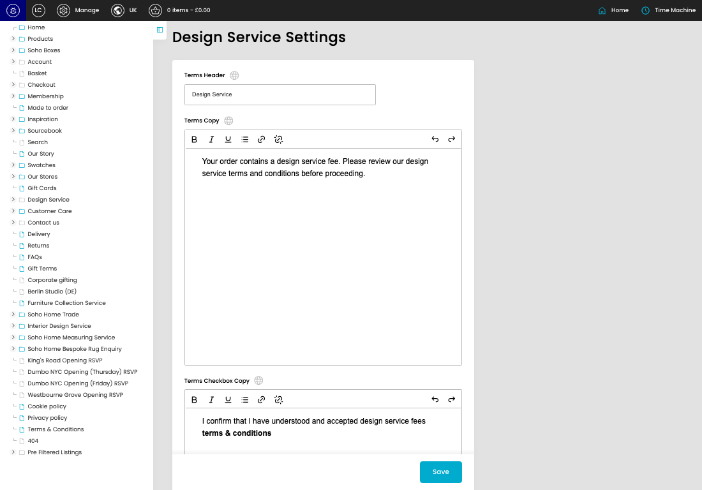

# Design Service Settings

[Design Service Settings overview](../../index.md) / Design Service Settings

URL: [https://sohohome.com/cp/design-service-settings-admin](https://sohohome.com/cp/design-service-settings-admin)

Use this page to manage Design Service Settings.

*Design Service Settings page overview*

## Using This Page

1. Open a Design Service Setting entry from the listing, or select Create new.
2. Complete the labelled settings for the entry.
3. Select Save to apply the changes.

## What You Can Do

### Create a new entry

Select Create new to add a Design Service Setting entry, then complete the labelled settings and save.

### Edit an existing entry

Open an existing Design Service Setting entry to review or update its settings.

- Save applies the changes.

## Key Settings

The sections below highlight the settings people are most likely to change.

### Design Service Settings

#### Terms Header

*Terms Header setting*

Enter the Terms Header.

**Effect:** Updates Terms Header.

**Validation:** Required.

#### Terms Copy

*Terms Copy setting*

Enter the Terms Copy content.

**Effect:** Updates Terms Copy.

#### Terms Checkbox Copy

*Terms Checkbox Copy setting*

Enter the Terms Checkbox Copy content.

**Effect:** Updates Terms Checkbox Copy.

## Available Actions

- Save
