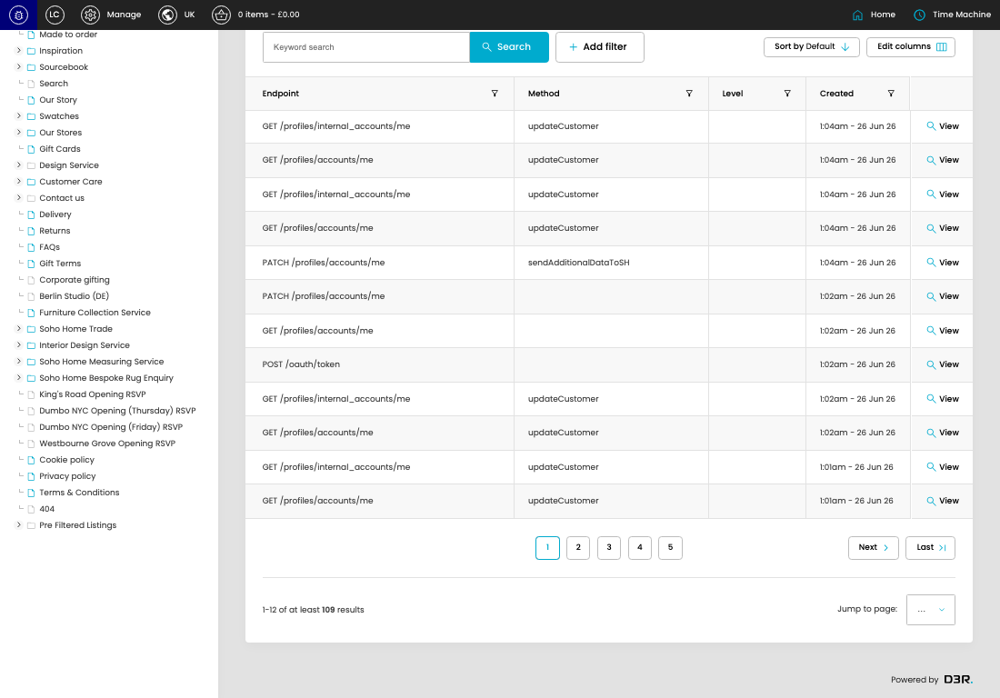

# Digital House Api Logs

[Digital House Api Logs overview](../../index.md) / Digital House Api Logs listing

URL: [https://sohohome.com/cp/dh-api-logs](https://sohohome.com/cp/dh-api-logs)

This page covers Digital House Api Logs.

*Digital House Api Logs page overview*

## Using This Page

1. Open the Digital House Api Logs page from the relevant navigation area or direct URL.
2. Use the listing to review existing Digital House Api Log entries.
3. Use the available create or edit actions to manage individual entries.

## What You Can Do

### Review existing entries

Use the listing to search, filter, and review existing Digital House Api Log entries.

- Column: Endpoint
- Column: Method
- Column: Level
- Column: Created

### Create a new entry

Select Create new to add a Digital House Api Log entry, then complete the labelled settings and save.

### Edit an existing entry

Open an existing Digital House Api Log entry to review or update its settings.

## Key Settings

The sections below highlight the settings people are most likely to change.

### Digital House Api Logs

#### select

*select setting*

Choose the select from the available options.

**Effect:** Updates select.

**Options:** …, 1, 2, 3, 4, 5, 6, 7, 8, 9, 10

## Available Actions

- Export csv
- Search
- Add filter
- Sort by Default
- Edit columns
- 2
- 3
- 4
- 5
- Next
- Last
