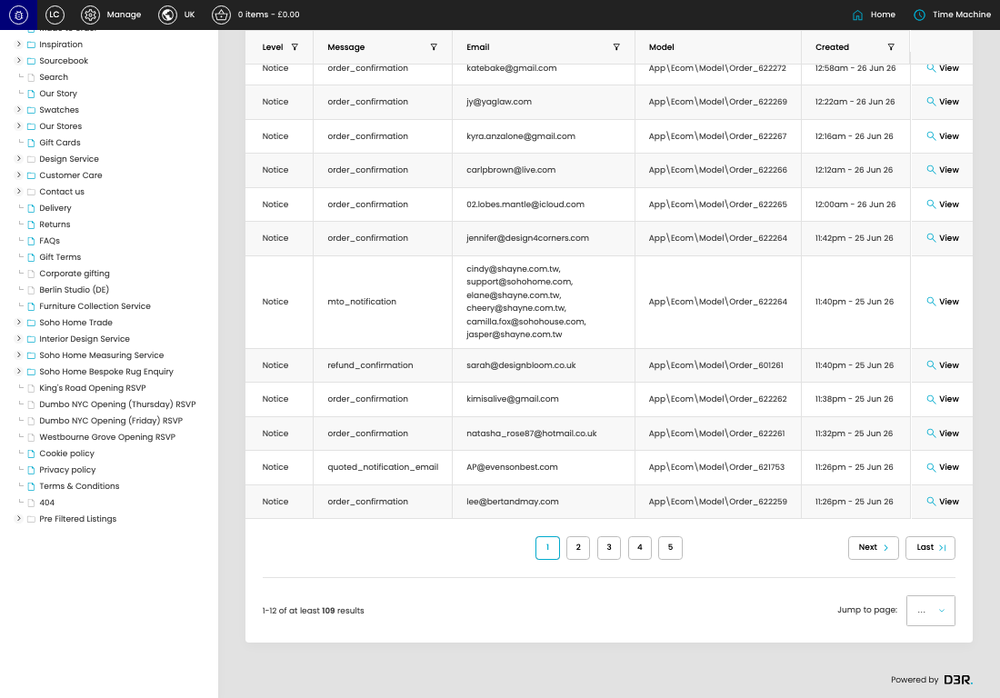

# Email Logs

[Email Logs overview](../../index.md) / Email Logs listing

URL: [https://sohohome.com/cp/email-log-admin](https://sohohome.com/cp/email-log-admin)

Use this page to manage Email Logs.

*Email Logs page overview*

## Using This Page

1. Open the Email Logs page from the relevant navigation area or direct URL.
2. Use the listing to review existing Email Log entries.
3. Use the available create or edit actions to manage individual entries.

## What You Can Do

### Review existing entries

Use the listing to search, filter, and review existing Email Log entries.

- Column: Level
- Column: Message
- Column: Email
- Column: Model
- Column: Created

### Create a new entry

Select Create new to add a Email Log entry, then complete the labelled settings and save.

### Edit an existing entry

Open an existing Email Log entry to review or update its settings.

## Key Settings

The sections below highlight the settings people are most likely to change.

### Email Logs

#### select

*select setting*

Choose the select from the available options.

**Effect:** Updates select.

**Options:** …, 1, 2, 3, 4, 5, 6, 7, 8, 9, 10

## Available Actions

- Search
- Add filter
- Sort by Default
- Edit columns
- 2
- 3
- 4
- 5
- Next
- Last
