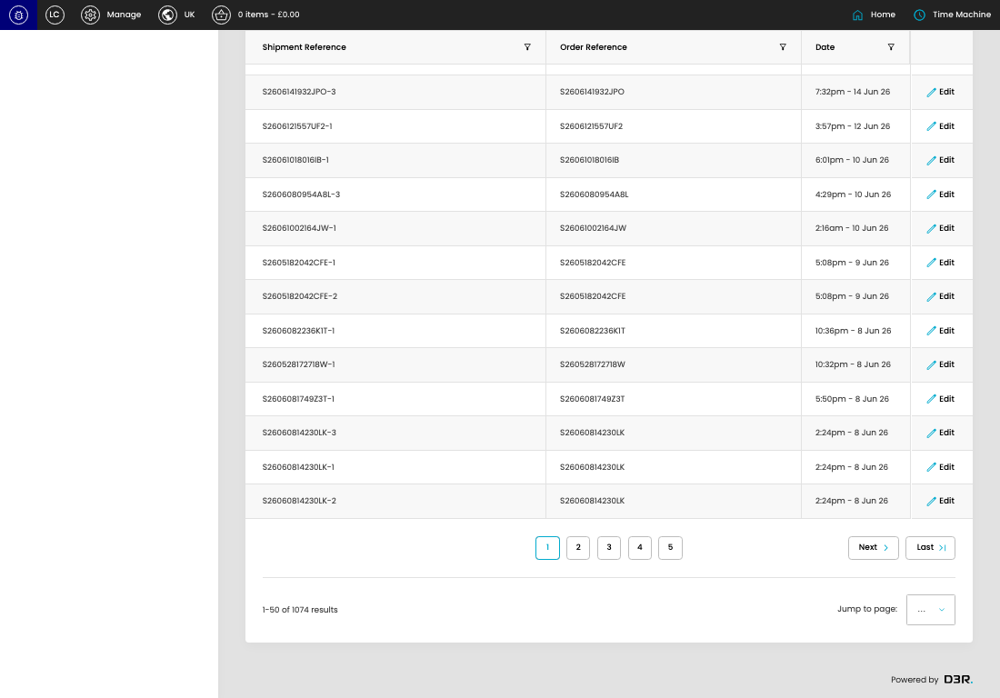

# Empty Shipments

[Empty Shipments overview](../../index.md) / Empty Shipments listing

URL: [https://sohohome.com/cp/empty_shipments-admin](https://sohohome.com/cp/empty_shipments-admin)

Use this page to manage Empty Shipments.

*Empty Shipments page overview*

## Using This Page

1. Open the Empty Shipments page from the relevant navigation area or direct URL.
2. Use the listing to review existing Empty Shipment entries.
3. Use the available create or edit actions to manage individual entries.

## What You Can Do

### Review existing entries

Use the listing to search, filter, and review existing Empty Shipment entries.

- Column: Shipment Reference
- Column: Order Reference
- Column: Date

### Create a new entry

Select Create new to add a Empty Shipment entry, then complete the labelled settings and save.

### Edit an existing entry

Open an existing Empty Shipment entry to review or update its settings.

## Key Settings

The sections below highlight the settings people are most likely to change.

### Empty Shipments

#### select

*select setting*

Choose the select from the available options.

**Effect:** Updates select.

**Options:** …, 1, 2, 3, 4, 5, 6, 7, 8, 9, 10, 11, and 11 more

## Available Actions

- Export csv
- Search
- Add filter
- Sort by Default
- Edit columns
- 2
- 3
- 4
- 5
- Next
- Last
