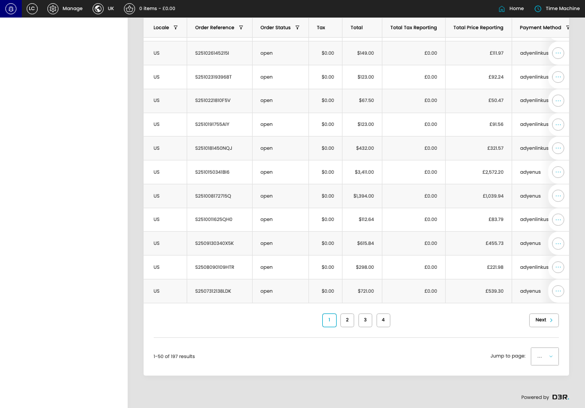
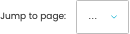

# Failed Orders (Avalara)

[Failed Orders (Avalara) overview](../../index.md) / Failed Orders (Avalara) listing

URL: [https://sohohome.com/cp/failed-avarala-orders-admin](https://sohohome.com/cp/failed-avarala-orders-admin)

This page covers Failed Orders (Avalara).

*Failed Orders (Avalara) page overview*

## Using This Page

1. Open the Failed Orders (Avalara) page from the relevant navigation area or direct URL.
2. Use the listing to review existing Failed Orders (Avalara) entries.
3. Use the available create or edit actions to manage individual entries.

## What You Can Do

### Review existing entries

Use the listing to search, filter, and review existing Failed Orders (Avalara) entries.

- Column: Locale
- Column: Order Reference
- Column: Order Status
- Column: Tax
- Column: Total
- Column: Total Tax Reporting
- Column: Total Price Reporting
- Column: Payment Method
- Column: Error
- Column: Error Detail
- Column: Error Created
- Column: Automated Status

### Create a new entry

Select Create new to add a Failed Orders (Avalara) entry, then complete the labelled settings and save.

### Edit an existing entry

Open an existing Failed Orders (Avalara) entry to review or update its settings.

- Save applies the changes.

## Key Settings

The sections below highlight the settings people are most likely to change.

### Failed Orders (Avalara)

#### select

*select setting*

Choose the select from the available options.

**Effect:** Updates select.

**Options:** Load saved view, Zip invalid

#### select

*select setting*

Choose the select from the available options.

**Effect:** Updates select.

**Options:** …, 1, 2, 3, 4

## Available Actions

- Unresolved
- All
- Grouped
- Export csv
- Add filter
- Manage saved views
- Sort by Default
- Edit columns
- 2
- 3
- 4
- Next
