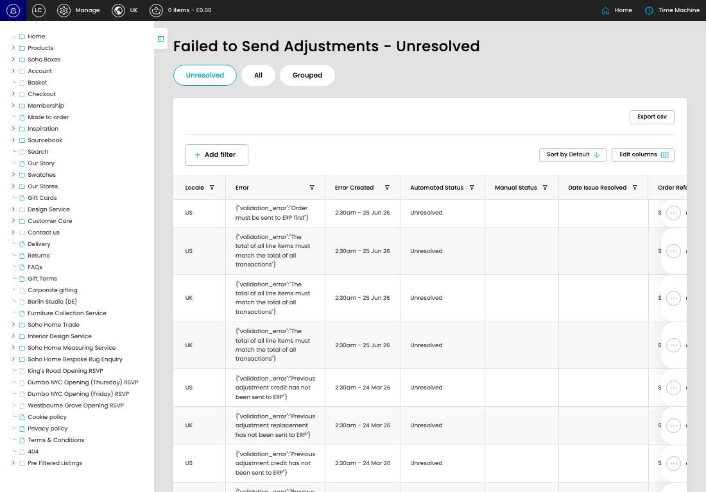

# Failed Adjustments

[Failed Adjustments overview](../../index.md) / Failed Adjustments listing

URL: [https://sohohome.com/cp/failed-bc-adjustments-admin](https://sohohome.com/cp/failed-bc-adjustments-admin)

This page covers Failed Adjustments.

*Failed Adjustments page overview*

## Using This Page

1. Open the Failed Adjustments page from the relevant navigation area or direct URL.
2. Use the listing to review existing Failed Adjustment entries.
3. Use the available create or edit actions to manage individual entries.

## What You Can Do

### Review existing entries

Use the listing to search, filter, and review existing Failed Adjustment entries.

- Column: Locale
- Column: Error
- Column: Error Created
- Column: Automated Status
- Column: Manual Status
- Column: Date Issue Resolved
- Column: Order Reference
- Column: Order Status
- Column: Adjustment Suffix
- Column: Adjustment Value
- Column: Adjustment Reporting Value
- Column: Adjustment Created

### Create a new entry

Select Create new to add a Failed Adjustment entry, then complete the labelled settings and save.

### Edit an existing entry

Open an existing Failed Adjustment entry to review or update its settings.

## Available Actions

- Unresolved
- All
- Grouped
- Export csv
- Add filter
- Sort by Default
- Edit columns
