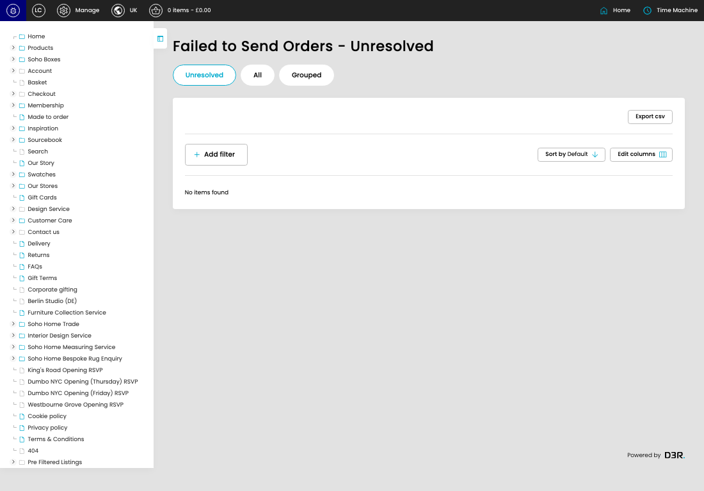

# Failed Orders

[Failed Orders overview](../../index.md) / Failed Orders

URL: [https://sohohome.com/cp/failed-bc-orders-admin](https://sohohome.com/cp/failed-bc-orders-admin)

This page covers Failed Orders.

*Failed Orders page overview*

## Using This Page

1. Open a Failed Order entry from the listing, or select Create new.
2. Complete the labelled settings for the entry.
3. Select Save to apply the changes.

## What You Can Do

### Create a new entry

Select Create new to add a Failed Order entry, then complete the labelled settings and save.

### Edit an existing entry

Open an existing Failed Order entry to review or update its settings.

## Available Actions

- Unresolved
- All
- Grouped
- Export csv
- Add filter
- Sort by Default
- Edit columns
