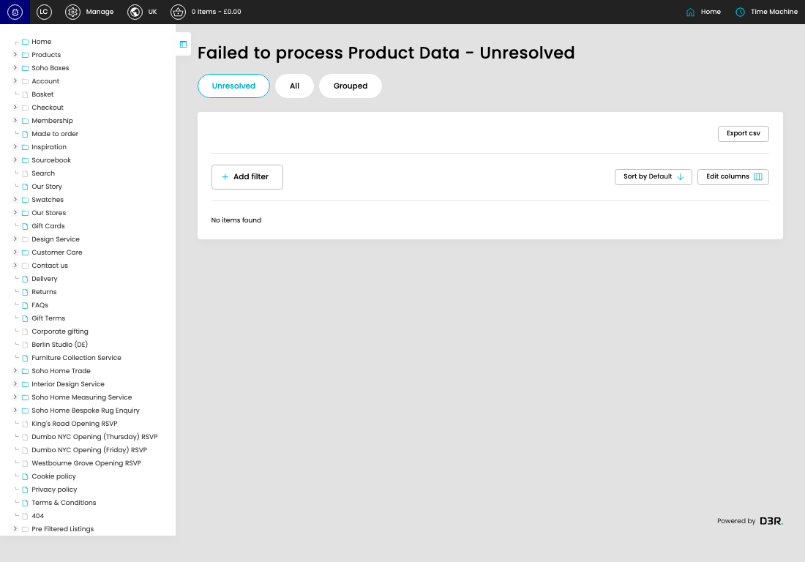

# Failed Product Data

[Failed Product Data overview](../../index.md) / Failed Product Data

URL: [https://sohohome.com/cp/failed-bc-product-data-admin](https://sohohome.com/cp/failed-bc-product-data-admin)

This page covers Failed Product Data.

*Failed Product Data page overview*

## Using This Page

1. Open a Failed Product Data entry from the listing, or select Create new.
2. Complete the labelled settings for the entry.
3. Select Save to apply the changes.

## What You Can Do

### Create a new entry

Select Create new to add a Failed Product Data entry, then complete the labelled settings and save.

### Edit an existing entry

Open an existing Failed Product Data entry to review or update its settings.

## Available Actions

- Unresolved
- All
- Grouped
- Export csv
- Add filter
- Sort by Default
- Edit columns
