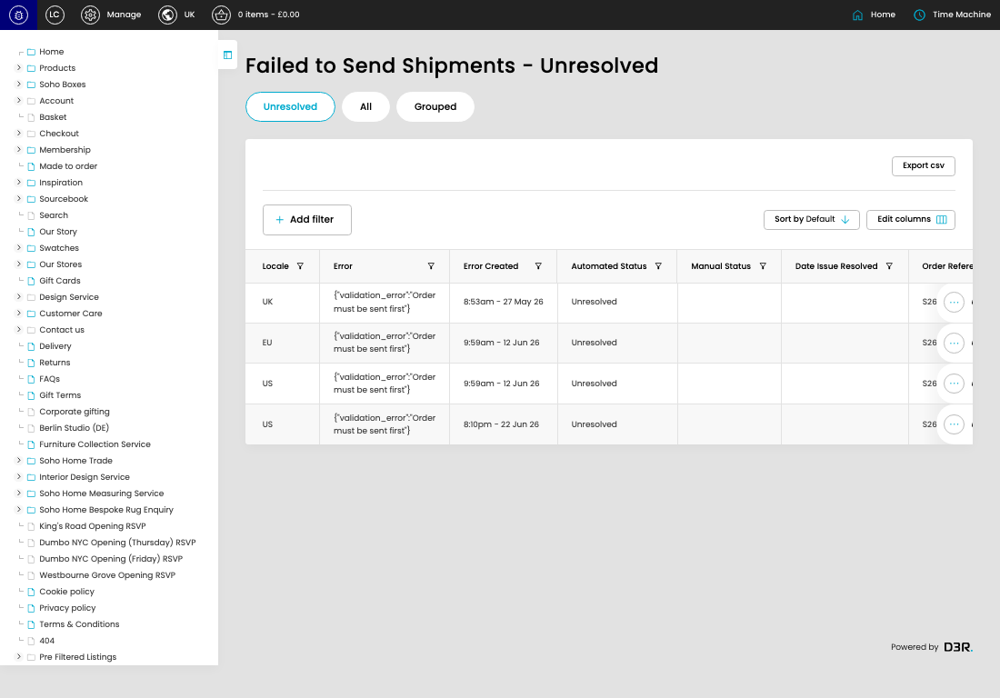

# Failed Shipments

[Failed Shipments overview](../../index.md) / Failed Shipments listing

URL: [https://sohohome.com/cp/failed-bc-shipments-admin](https://sohohome.com/cp/failed-bc-shipments-admin)

This page covers Failed Shipments.

*Failed Shipments page overview*

## Using This Page

1. Open the Failed Shipments page from the relevant navigation area or direct URL.
2. Use the listing to review existing Failed Shipment entries.
3. Use the available create or edit actions to manage individual entries.

## What You Can Do

### Review existing entries

Use the listing to search, filter, and review existing Failed Shipment entries.

- Column: Locale
- Column: Error
- Column: Error Created
- Column: Automated Status
- Column: Manual Status
- Column: Date Issue Resolved
- Column: Order Reference
- Column: Order Status
- Column: Shipment Reference
- Column: Shipment Status
- Column: Shipment Created
- Column: Shipment Value

### Create a new entry

Select Create new to add a Failed Shipment entry, then complete the labelled settings and save.

### Edit an existing entry

Open an existing Failed Shipment entry to review or update its settings.

## Available Actions

- Unresolved
- All
- Grouped
- Export csv
- Add filter
- Sort by Default
- Edit columns
