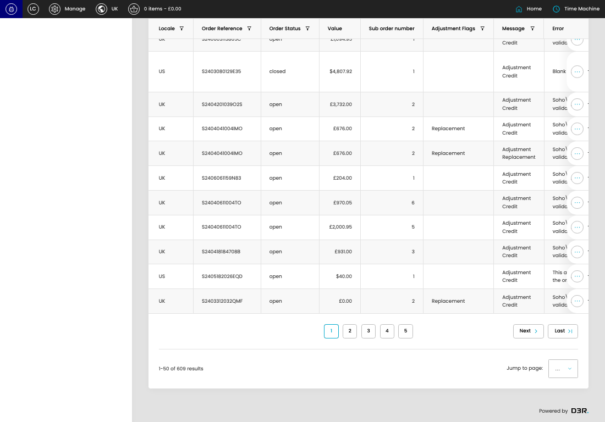

# Failed Adjustments (Sage)

[Failed Adjustments (Sage) overview](../../index.md) / Failed Adjustments (Sage) listing

URL: [https://sohohome.com/cp/failed-sage-adjustments-admin](https://sohohome.com/cp/failed-sage-adjustments-admin)

This page covers Failed Adjustments (Sage).

*Failed Adjustments (Sage) page overview*

## Using This Page

1. Open the Failed Adjustments (Sage) page from the relevant navigation area or direct URL.
2. Use the listing to review existing Failed Adjustments (Sage) entries.
3. Use the available create or edit actions to manage individual entries.

## What You Can Do

### Review existing entries

Use the listing to search, filter, and review existing Failed Adjustments (Sage) entries.

- Column: Locale
- Column: Order Reference
- Column: Order Status
- Column: Value
- Column: Sub order number
- Column: Adjustment Flags
- Column: Message
- Column: Error
- Column: Error Detail
- Column: Order Created
- Column: Adjustment Created
- Column: Error Created

### Create a new entry

Select Create new to add a Failed Adjustments (Sage) entry, then complete the labelled settings and save.

### Edit an existing entry

Open an existing Failed Adjustments (Sage) entry to review or update its settings.

## Key Settings

The sections below highlight the settings people are most likely to change.

### Failed Adjustments (Sage)

#### select

*select setting*

Choose the select from the available options.

**Effect:** Updates select.

**Options:** …, 1, 2, 3, 4, 5, 6, 7, 8, 9, 10, 11, and 2 more

## Available Actions

- Unresolved
- All
- Grouped
- Mismatched
- Export csv
- Add filter
- Sort by Default
- Edit columns
- 2
- 3
- 4
- 5
- Next
- Last
