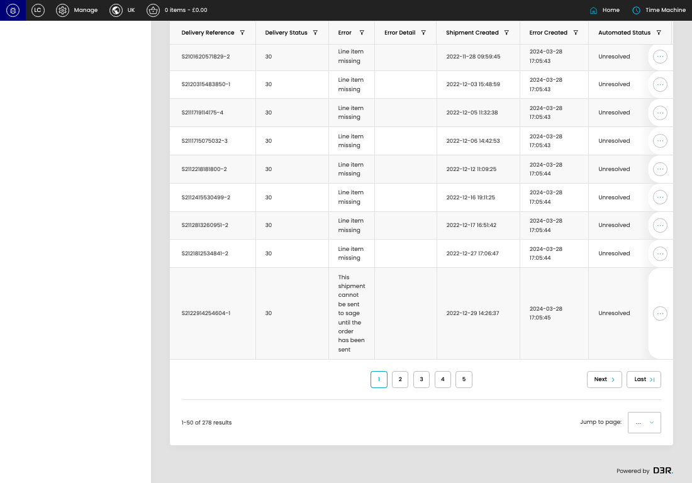

# Failed Shipments (Sage)

[Failed Shipments (Sage) overview](../../index.md) / Failed Shipments (Sage) listing

URL: [https://sohohome.com/cp/failed-sage-shipments-admin](https://sohohome.com/cp/failed-sage-shipments-admin)

This page covers Failed Shipments (Sage).

*Failed Shipments (Sage) page overview*

## Using This Page

1. Open the Failed Shipments (Sage) page from the relevant navigation area or direct URL.
2. Use the listing to review existing Failed Shipments (Sage) entries.
3. Use the available create or edit actions to manage individual entries.

## What You Can Do

### Review existing entries

Use the listing to search, filter, and review existing Failed Shipments (Sage) entries.

- Column: Delivery Reference
- Column: Delivery Status
- Column: Error
- Column: Error Detail
- Column: Shipment Created
- Column: Error Created
- Column: Automated Status
- Column: Manual Status
- Column: Date Issue Resolved

### Create a new entry

Select Create new to add a Failed Shipments (Sage) entry, then complete the labelled settings and save.

### Edit an existing entry

Open an existing Failed Shipments (Sage) entry to review or update its settings.

## Key Settings

The sections below highlight the settings people are most likely to change.

### Failed Shipments (Sage)

#### select

*select setting*

Choose the select from the available options.

**Effect:** Updates select.

**Options:** …, 1, 2, 3, 4, 5, 6

## Available Actions

- Unresolved
- All
- Grouped
- Export csv
- Add filter
- Sort by Default
- Edit columns
- 2
- 3
- 4
- 5
- Next
- Last
