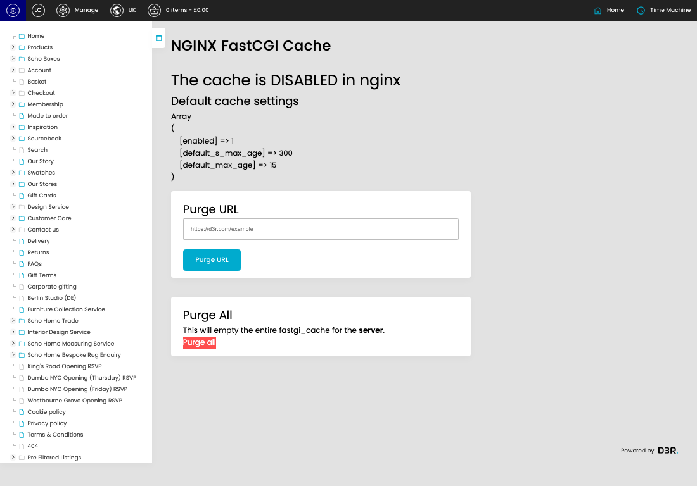
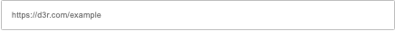

# FastCGI Cache

[FastCGI Cache overview](../../index.md) / FastCGI Cache

URL: [https://sohohome.com/cp/fastcgi-cache](https://sohohome.com/cp/fastcgi-cache)

This page covers FastCGI Cache.

*FastCGI Cache page overview*

## Using This Page

1. Open a FastCGI Cache entry from the listing, or select Create new.
2. Complete the labelled settings for the entry.
3. Select Save to apply the changes.

## What You Can Do

### Create a new entry

Select Create new to add a FastCGI Cache entry, then complete the labelled settings and save.

### Edit an existing entry

Open an existing FastCGI Cache entry to review or update its settings.

## Key Settings

The sections below highlight the settings people are most likely to change.

### Purge URL

#### https://d3r.com/example

*https://d3r.com/example setting*

Enter a value matching "https://d3r.com/example".

**Effect:** Updates https://d3r.com/example.

## Available Actions

- Purge URL
- Purge all
